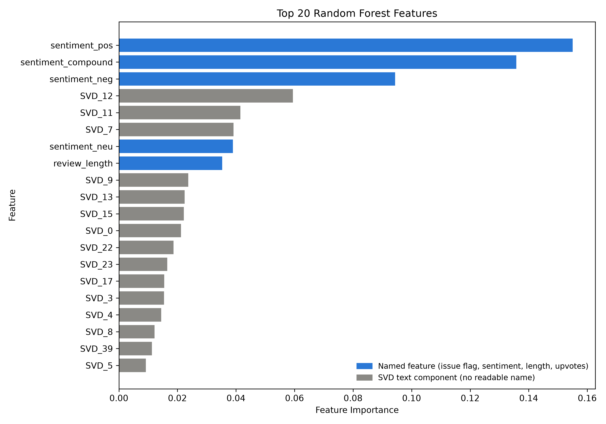
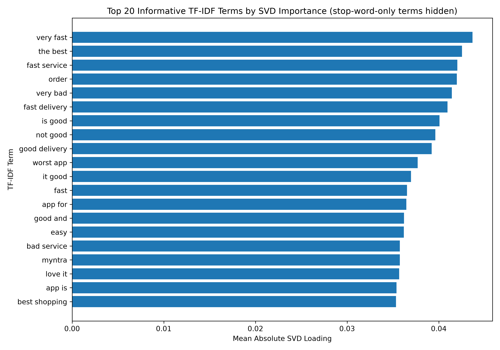

# Model Evaluation & Interpretation — Findings & Method

**Capstone Project — Stage 5: Predictive Modeling**

*Owners: Harshini Vennela and Kanishka D · Input: `data/engineered_features.npz`, `data/target.npy`, `data/model_row_index.csv.gz` (all built by `scripts/05_feature_engineering.py`) · Code: `scripts/06_model_training.py` to `scripts/12_normalized_confusion_matrices.py`*

Outputs: trained Logistic Regression and Random Forest models (`models/`), evaluation metrics, test-set predictions, per-app and out-of-time results, and the charts in `figures/`.

The evaluation uses 1,137,987 reviews from 11 apps (`Sort.NEWEST`, 1 Apr – 20 Sep 2026).

---

## 1. Headline findings

1. **The task is binary classification of problematic reviews.** A review is `1` (problematic) when its rating is ≤ 2, otherwise `0`.
2. **The classes are imbalanced.** 19.5% of reviews are problematic. A model that never flags anything scores **80.5% accuracy with 0% recall**, so accuracy alone is not a useful headline. We report PR-AUC, recall and precision as well.
3. **Both models score above 91% accuracy and about 0.94 ROC-AUC on 227,598 held-out reviews.** They are close, and each is better on different measures.
4. **Logistic Regression is better at the default threshold.** Accuracy 92.2%, precision 76.7%, F1 0.810. It raises 2,205 fewer false alarms than Random Forest.
5. **Random Forest ranks reviews slightly better.** PR-AUC 0.873 (vs a 0.195 base rate), ROC-AUC 0.941 and recall 87.0%, so it misses the fewest complaints.
6. **Performance holds on future data.** Trained on April–August and tested on 1–20 September, PR-AUC drops by less than 0.01 (Random Forest 0.866, Logistic Regression 0.862).
7. **Payments is the hardest domain.** Random Forest PR-AUC is 0.895 for Food & Grocery and 0.869 for Shopping, but 0.750 for Payments. PhonePe is the hardest app (0.678): its complaints are rare (9.7%) and short (median 6 words, against 12 for all apps).
8. **Sentiment leads the Random Forest's importance chart, but the text adds the most.** The positive, compound and negative VADER scores are its top three features; with the neutral score (7th) the four make up 42% of total importance. In an ablation, the 200 text components alone reach PR-AUC 0.852 (Logistic Regression) and 0.854 (Random Forest), more than sentiment alone (0.739 and 0.802); all 215 features give 0.871 and 0.873 (§8.2).
9. **The results are stable and the settings hold up.** 95% bootstrap intervals are about ±0.003 for PR-AUC and ±0.001 for accuracy. On a validation split of the training data, Logistic Regression's `C=1` is the best of four values, and the Random Forest's 100-review leaves are within 0.005 PR-AUC of the best setting tried, at a third of its size (§8).

---

## 2. Method

| Choice | Details |
|---|---|
| Target | `is_problematic = 1` when `score <= 2`, otherwise `0` |
| Input features | 215: 200 SVD text components + 15 structural features |
| Text representation | TF-IDF (20,000 terms, 1–2 grams, min_df 3, max_df 0.95, sublinear term frequency, no stop-word list) → Truncated SVD (200 components) |
| Train/test split | 80% / 20%, stratified, random state 42 (910,389 / 227,598 reviews) |
| Logistic Regression | `class_weight="balanced"`, `max_iter=1000` |
| Random Forest | 150 trees, each on a 30% bootstrap sample, `min_samples_leaf=100`, `class_weight="balanced"` |
| Baseline | Always predict the majority class (`data/baseline_results.csv`) |
| Settings check | `C` (Logistic Regression) and `min_samples_leaf` (Random Forest) compared on a validation split of the training data; test set not used (§8.3) |
| Extra checks | Per-domain and per-app metrics (`data/model_results_by_group.csv`); out-of-time test, train < 1 Sep 2026 ≤ test (`data/model_results_out_of_time.csv`) |
| Evaluation metrics | Accuracy, Precision, Recall, F1, ROC-AUC, PR-AUC |

**Why no stop-word list.** The standard English stop-word list removes "not", "no" and "never", so "not good" and "good" would look the same. Without it, negated phrases such as "not good" and "very bad" become features.

**Why the Random Forest is size-limited.** Fully grown trees on 910,389 rows would take gigabytes, which GitHub cannot store and which is slow to load. Subsampling each tree to 30% of rows and requiring at least 100 reviews per leaf keeps the model at 9.8 MB. The whole training script (both models, baseline, out-of-time re-fit) runs in about 3 minutes on 20 cores.

---

## 3. Dataset and feature representation

| Item | Value |
|---|---|
| Reviews | 1,137,987 |
| TF-IDF terms | 20,000 |
| SVD components | 200 (62.7% of TF-IDF variance kept) |
| Structural features | 15: 9 issue flags, 4 VADER scores, `review_length`, `thumbs_up` |
| Total features | 215 |

| Target | Count | Share | Meaning |
|---|---:|---:|---|
| 0 | 916,406 | 80.5% | Non-problematic |
| 1 | 221,581 | 19.5% | Problematic |

The SVD keeps a large share of the variance because most reviews use a small vocabulary ("good", "nice app", "worst service").

---

## 4. Model performance (test set, 227,598 reviews)

| Model | Accuracy | Precision | Recall | F1 | ROC-AUC | PR-AUC |
|---|---:|---:|---:|---:|---:|---:|
| Majority-class baseline | 0.805 | 0.000 | 0.000 | 0.000 | 0.500 | 0.195 |
| Logistic Regression | **0.922** | **0.767** | 0.858 | **0.810** | 0.940 | 0.871 |
| Random Forest | 0.914 | 0.737 | **0.870** | 0.798 | **0.941** | **0.873** |

Bold = better of the two models.


---

## 5. Confusion matrices

| Model | True negative | False positive | False negative | True positive |
|---|---:|---:|---:|---:|
| Logistic Regression | 171,744 | 11,538 | 6,297 | 38,019 |
| Random Forest | 169,539 | 13,743 | 5,756 | 38,560 |

Random Forest finds 541 more of the 44,316 problem reviews (38,560 vs 38,019). Logistic Regression raises 2,205 (16%) fewer false alarms.


---

## 6. ROC and Precision-Recall evaluation


The dashed line on the PR chart is the 19.5% base rate, the precision of random guessing. At 80% recall, Random Forest's precision is 0.85 (Logistic Regression 0.84). At 90% recall both are still at 0.58, about three times the base rate. The two models' curves almost overlap: the difference between them is mainly where the default 0.5 threshold falls on each curve, not how well they rank reviews.

---

## 7. Per-domain, per-app and out-of-time results (Random Forest)

| Group | Test reviews | % problematic | Precision | Recall | PR-AUC |
|---|---:|---:|---:|---:|---:|
| Food & Grocery | 99,491 | 21.7 | 0.738 | 0.905 | 0.895 |
| Shopping | 97,360 | 19.2 | 0.764 | 0.843 | 0.869 |
| Payments | 30,747 | 12.9 | 0.626 | 0.805 | 0.750 |
| Amazon | 6,705 | 54.8 | 0.908 | 0.961 | 0.969 |
| Swiggy | 15,001 | 35.2 | 0.873 | 0.935 | 0.948 |
| Myntra | 16,954 | 10.4 | 0.654 | 0.949 | 0.926 |
| Meesho | 20,509 | 17.8 | 0.693 | 0.942 | 0.909 |
| Domino's | 8,568 | 23.9 | 0.784 | 0.889 | 0.898 |
| Zomato | 30,215 | 18.7 | 0.739 | 0.881 | 0.879 |
| Blinkit | 45,707 | 19.0 | 0.664 | 0.906 | 0.865 |
| Google Pay | 4,049 | 23.4 | 0.685 | 0.855 | 0.813 |
| Flipkart | 53,192 | 18.1 | 0.771 | 0.742 | 0.800 |
| Paytm | 9,026 | 14.4 | 0.661 | 0.840 | 0.798 |
| PhonePe | 17,672 | 9.7 | 0.569 | 0.751 | 0.678 |

PR-AUC rises with the share of problem reviews, so compare each app against its own base rate. Even so, the payment apps are the weakest: their complaints are rarer and shorter (median 8 words in Payments, against 11 in Food & Grocery and 16 in Shopping). Flipkart and PhonePe have the lowest recall (74% and 75%). For Flipkart this is consistent with EDA §5: the most distinctive words in untagged 1–2★ reviews are praise words ("nice product", "mast", "super"), mostly from Flipkart, i.e. users who mis-rate.

| Out-of-time test (train < 1 Sep ≤ test) | Train | Test | Precision | Recall | ROC-AUC | PR-AUC |
|---|---:|---:|---:|---:|---:|---:|
| Logistic Regression | 1,008,932 | 129,055 | 0.748 | 0.849 | 0.938 | 0.862 |
| Random Forest | 1,008,932 | 129,055 | 0.721 | 0.862 | 0.939 | 0.866 |

PR-AUC drops by less than 0.01 compared with the random split. The models do not depend on mixing past and future reviews.

## 8. Robustness checks

Script: `scripts/13_model_robustness_checks.py` (about 20 minutes on 20 cores). It rebuilds the same split as `scripts/06`, checks that the saved models reproduce `data/model_results.csv` exactly, and never uses the test set to choose anything.

### 8.1 Confidence intervals (1,000 bootstrap resamples of the test set)

| Metric | Logistic Regression | Random Forest | Random Forest − Logistic Regression |
|---|---|---|---|
| Accuracy | 0.9216 (0.9206–0.9227) | 0.9143 (0.9132–0.9154) | −0.0073 (−0.0080 to −0.0066) |
| Precision | 0.7672 (0.7636–0.7709) | 0.7372 (0.7338–0.7410) | −0.0299 (−0.0320 to −0.0279) |
| Recall | 0.8579 (0.8547–0.8609) | 0.8701 (0.8670–0.8730) | +0.0122 (+0.0108 to +0.0137) |
| F1 | 0.8100 (0.8073–0.8126) | 0.7982 (0.7955–0.8009) | −0.0118 (−0.0132 to −0.0103) |
| ROC-AUC | 0.9400 (0.9385–0.9413) | 0.9411 (0.9396–0.9424) | +0.0011 (+0.0005 to +0.0017) |
| PR-AUC | 0.8710 (0.8681–0.8738) | 0.8735 (0.8708–0.8762) | +0.0025 (+0.0014 to +0.0036) |

The intervals are narrow because the test set is large (about ±0.003 for PR-AUC and ±0.001 for accuracy). None of the difference intervals contains zero, so the two models really do differ, but only slightly: Logistic Regression is better at the default threshold and Random Forest ranks reviews slightly better. Output: `data/model_bootstrap_ci.csv`.

### 8.2 What each feature group adds (ablation)

Both models were retrained with the same settings on subsets of the 215 features and scored on the same test set.

| Features | Count | LR PR-AUC | RF PR-AUC | LR F1 | RF F1 |
|---|---:|---:|---:|---:|---:|
| Text only (SVD components) | 200 | 0.8524 | 0.8542 | 0.7851 | 0.7836 |
| Sentiment only (4 VADER scores) | 4 | 0.7390 | 0.8016 | 0.6900 | 0.6972 |
| Structural only (issue flags, sentiment, length, upvotes) | 15 | 0.8395 | 0.8482 | 0.7029 | 0.7626 |
| All except sentiment | 211 | 0.8573 | 0.8569 | 0.7900 | 0.7836 |
| All features (final models) | 215 | 0.8710 | 0.8735 | 0.8100 | 0.7982 |

- The 200 text components on their own are the strongest group (PR-AUC about 0.85), ahead of the 4 sentiment scores on their own (0.739 for Logistic Regression, 0.802 for Random Forest) and all 15 structural features together (about 0.84–0.85).
- Every group adds something. Adding the text to the structural features raises PR-AUC by about 0.03 (Logistic Regression) and 0.025 (Random Forest); adding sentiment to everything else raises it by about 0.014 and 0.017.
- The Random Forest importance chart (§9) ranks the sentiment scores first because each is one strong column, while the text signal is spread over 200 components. Measured by what they add, text and sentiment are both needed.

Output: `data/model_ablation.csv`.

### 8.3 Settings check (validation split of the training data)

The 910,389 training reviews were split again, stratified 80/20 (728,311 to fit, 182,078 to validate). The test set was not used.

| Model | Setting | Validation PR-AUC | Validation F1 | Model size vs current |
|---|---|---:|---:|---:|
| Logistic Regression | `C=0.01` | 0.8607 | 0.7688 | – |
| Logistic Regression | `C=0.1` | 0.8699 | 0.8071 | – |
| Logistic Regression | `C=1` (used) | 0.8720 | 0.8110 | – |
| Logistic Regression | `C=10` | 0.8719 | 0.8113 | – |
| Random Forest | `min_samples_leaf=25` | 0.8786 | 0.8079 | 2.80× |
| Random Forest | `min_samples_leaf=50` | 0.8769 | 0.8023 | 1.72× |
| Random Forest | `min_samples_leaf=100` (used) | 0.8742 | 0.7959 | 1.00× |
| Random Forest | `min_samples_leaf=200` | 0.8701 | 0.7869 | 0.56× |

- **Logistic Regression:** `C=1` (the default, used) is the best of the four values; `C=10` gives the same validation PR-AUC to three decimals, and stronger regularisation is worse.
- **Random Forest:** smaller leaves score slightly higher. 25 reviews per leaf adds 0.0044 validation PR-AUC and 0.012 F1, but the forest has 2.8 times as many nodes (roughly 27 MB instead of 9.8 MB). We keep 100 reviews per leaf: the largest gain on offer is under 0.005 PR-AUC.

Output: `data/model_tuning.csv`.

---

## 9. Model interpretation



| Rank | Random Forest feature | Importance |
|---:|---|---:|
| 1 | `sentiment_pos` | 0.155 |
| 2 | `sentiment_compound` | 0.136 |
| 3 | `sentiment_neg` | 0.094 |
| 4 | SVD_12 | 0.059 |
| 5 | SVD_11 | 0.042 |
| 6 | SVD_7 | 0.039 |
| 7 | `sentiment_neu` | 0.039 |
| 8 | `review_length` | 0.035 |

The charts use the real feature names (saved in `data/feature_names.json`). Logistic Regression's largest coefficients are all text components (SVD_27 −10.2, SVD_23 −9.7). The SVD components are not standardised while the 15 structural features are, so coefficient sizes cannot be compared across the two groups. Among the structural features, the largest are `sentiment_compound` (−0.92: more positive text, less likely a problem) and `review_length` (+0.24: longer reviews are more likely complaints).



The terms with the largest SVD loadings are a mix of praise ("very fast", "the best", "fast service", "fast delivery", "good delivery") and complaint phrases ("very bad", "not good", "worst app"). Because stop words are kept, negated phrases such as "not good" appear among them. Terms made only of stop words ("to", "my", "the") also get large loadings, so the chart hides them and shows the top 20 informative terms; they remain in the model. The text components separate the praise and complaint vocabularies.

---

## 10. Practical interpretation

- **Triage:** at the default threshold the Random Forest flags about 52,000 of 228,000 test reviews and catches 87.0% of real complaints; about 3 in 4 flagged reviews are real complaints. Logistic Regression flags about 50,000, catches 85.8% and is right about 77% of the time. Use Random Forest when missing a complaint is costly and Logistic Regression when reviewer time is the limit.
- **Per domain:** the model can be used as-is for Food & Grocery and Shopping. For payment apps, expect about 4 in 10 flags to be false alarms.
- **Short reviews:** most reviews are 1–3 words. For these the model mostly reads sentiment ("worst" vs "good"). The text components matter for the longer, more informative reviews.

---

## 11. Limitations

- The target comes from the star rating, so the model predicts "low rating", not a confirmed failure. Mis-ratings (1★ with "nice product") are counted as problems.
- TF-IDF, SVD and the scaler are fitted on all rows before the split. They do not use the target, but a stricter setup would fit them on training rows only.
- The settings check covers two parameters on one validation split; the TF-IDF settings and the number of SVD components were not searched. There is no cross-validation, but the bootstrap intervals on 227,598 test reviews are narrow (±0.003 PR-AUC).
- `thumbs_up` is only known after a review has been live for a while, so a brand-new review has 0. Its weight is small (−0.01 in Logistic Regression), but a live triage system should drop it.
- During the 21 Apr – 5 May feed gap, positive reviews are under-represented for five apps. This changes the label mix for those two weeks only.

---

## 12. Files and scripts

| File | Contents |
|---|---|
| `scripts/05_feature_engineering.py` | TF-IDF, SVD, structural features; writes the feature matrix (not tracked in git, ~570 MB, rebuilt in about 2.5 minutes) |
| `scripts/06_model_training.py` | Training, test metrics, baseline, per-group and out-of-time results |
| `scripts/07`–`12` | Charts, feature importance, AUC summary, error summary, normalized confusion matrices |
| `scripts/13_model_robustness_checks.py` | Bootstrap confidence intervals, feature-group ablation, settings check (§8) |
| `scripts/14_predict_review.py` | Classifies new review text with the saved models (issue tags, VADER, TF-IDF → SVD, scaler, both classifiers) |
| `data/model_bootstrap_ci.csv`, `data/model_ablation.csv`, `data/model_tuning.csv` | Robustness check results |
| `data/model_results.csv`, `data/baseline_results.csv`, `data/model_results_by_group.csv`, `data/model_results_out_of_time.csv` | Metric tables |
| `data/model_predictions.csv.gz` | Test-set predictions with app and domain |
| `data/feature_engineering_summary.json`, `data/feature_names.json` | Feature matrix summary and names |
| `models/*.pkl` | TF-IDF, SVD, scaler, Logistic Regression, Random Forest |

```bash
python scripts/05_feature_engineering.py   # ~2.5 min
python scripts/06_model_training.py        # ~3 min on 20 cores
for s in 07_model_evaluation_charts 08_model_interpretation 09_model_performance_comparison \
         10_auc_summary 11_prediction_error_summary 12_normalized_confusion_matrices; do python scripts/$s.py; done
python scripts/13_model_robustness_checks.py  # ~20 min on 20 cores
```
