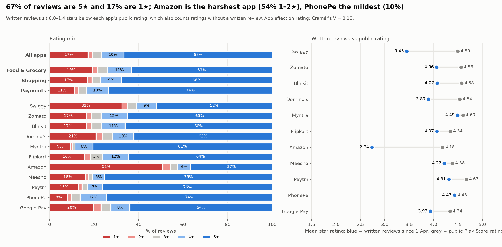
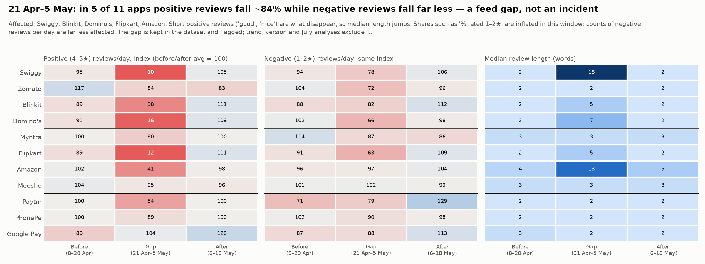
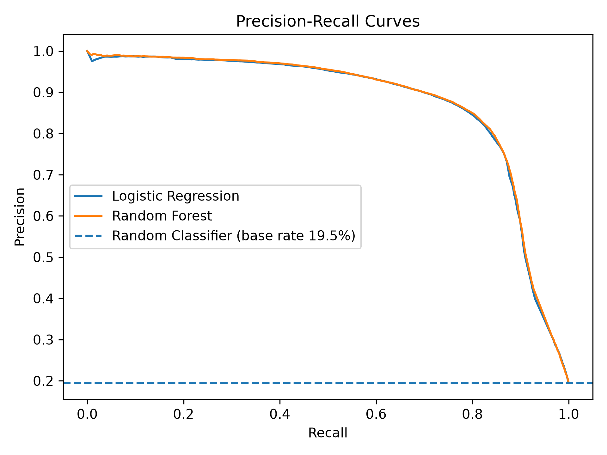

# Mobile App Update Impact and Failure Detection

**Project Report: Review 1**

Course: 23CSE452 Business Analytics

Review 1: Data Analysis and Predictive Modelling 

Team number: 10

Members:

| # | Name | Roll number |
|---|---|---|
| 1 | Aditya Monish Kumar K | CB.SC.U4CSE23103 |
| 2 | Regella Krishna Saketh | CB.SC.U4CSE23649 |
| 3 | Akshay KS | CB.SC.U4CSE23104 |
| 4 | Harshini Vennela | CB.SC.U4CSE23455 |
| 5 | Kanishka D | CB.SC.U4CSE23155 |

--- 

## 1. Problem Statement and Research Gap

### 1.1 Problem statement

Apps like Swiggy, Zomato, Blinkit, Flipkart, Amazon, Paytm and PhonePe get hundreds of Play Store reviews every day, and the busiest get more than a thousand. Many of these reviews report real problems: a failed payment, a late delivery, a refund that never came, an app that crashes after an update. A product team cannot read all of them. So problems are noticed late, and it is hard to say which problem is the biggest or whether things are getting better or worse.

Our project asks three questions:

1. What are users complaining about, and how does this differ from app to app?
2. Can we automatically flag problem reviews, and say which failure they describe?
3. Do some app versions bring more complaints than others (update impact)?

Two terms are used throughout:

- **Problem review:** a review rated 1 or 2 stars (`is_problematic = 1`). The star rating is the user's own judgement, so the classifier finds dissatisfied users. The 9 issue tags (Section 2.3) name the failure when the review text mentions one. Most reviews are very short (median 2 words), so many problem reviews say only "bad" or "worst app" and name no specific failure. Some are mis-ratings: the most common text among untagged 1–2 star reviews is "good" (8,342 reviews).
- **Update impact:** how ratings and complaints change between app versions. In Review 1 we compare each version with its app's average (Section 4, charts 12 and 13).

### 1.2 Existing methods

- Pagano and Maalej (2013) studied over one million App Store reviews and showed that reviews contain bug reports and feature requests that are useful to developers [1].
- Chen et al. (2014) built AR-Miner, which filters out reviews that carry no useful information and groups the rest by topic [2].
- Guzman and Maalej (2014) combined feature extraction with sentiment analysis to find how users feel about each app feature [3].
- Maalej and Nabil (2015) trained classifiers to label reviews as bug report, feature request, user experience or rating [4].
- Hutto and Gilbert (2014) proposed VADER, a rule-based sentiment scorer made for short informal text [5].

### 1.3 Research gap

- Most of these studies look at reviews as one fixed set. They do not follow complaints over time.
- They use general labels such as "bug" or "feature request". These labels do not match the day-to-day problems of Indian delivery, shopping and payment apps (refunds, delivery delay, OTP, cancellation).
- They usually do each task alone: only classification, or only sentiment. The results are not put together in a form a manager can use.
- The way reviews are collected can bias the results. This is rarely checked.

### 1.4 Proposed approach

We built one pipeline that goes from raw reviews to a problem-review classifier:

1. Collect every review of 11 apps from 1 April to 20 September 2026 ourselves from the Play Store: 1,137,987 reviews after cleaning (no ready-made dataset).
2. Clean the data.
3. Tag each review with issue categories and score its sentiment (Text Mining).
4. Explore the data, compare app versions and check for collection bias (EDA).
5. Build features and train a classifier that finds problem reviews (Predictive Modelling).

### 1.5 Business objective

Give a product or support team a quick and reliable view of:

- which problems hurt users most in each app,
- which new reviews need attention first,
- whether a new app version made things worse,
- whether the number of negative reviews this week is normal or unusual.

---

## 2. Dataset Description

### 2.1 Source and collection method

- Source: Google Play Store.
- Tool: the `google-play-scraper` Python package. It calls the Play Store review endpoint directly. No login is needed.
- Script: `scripts/01_scrape_reviews.py`. The list of apps is in `scripts/apps.py`.
- Settings: language English, country India, sort order `NEWEST`. We collected **every review posted from 1 April 2026 to 20 September 2026**.
- We did not use any dataset from Kaggle, UCI or GitHub.

| Domain | App | Package ID | Category |
|---|---|---|---|
| Food & Grocery | Swiggy | in.swiggy.android | Food and Drink |
| Food & Grocery | Zomato | com.application.zomato | Food and Drink |
| Food & Grocery | Blinkit | com.grofers.customerapp | Food and Drink |
| Food & Grocery | Domino's | com.Dominos | Food and Drink |
| Shopping | Myntra | com.myntra.android | Shopping |
| Shopping | Flipkart | com.flipkart.android | Shopping |
| Shopping | Amazon | in.amazon.mShop.android.shopping | Shopping |
| Shopping | Meesho | com.meesho.supply | Shopping |
| Payments | Paytm | net.one97.paytm | Finance |
| Payments | PhonePe | com.phonepe.app | Finance |
| Payments | Google Pay | com.google.android.apps.nbu.paisa.user | Finance |

Why `NEWEST` and a fixed start date: our first version used `MOST_RELEVANT` and 3,000 reviews per app. We tested that feed: for Swiggy it ran out after 11,200 reviews, while `NEWEST` returned more than 100,000 reviews for several apps. It also mixes years: Paytm and PhonePe went back to 2018, the other apps were almost all 2026. `NEWEST` has no limit. Collecting everything since one date gives every app the same time window, so apps can be compared week by week.

### 2.2 Dataset size

Each stage is stored as one compressed file per app, so that no file is larger than GitHub's 100 MB limit.

| Files | Rows | Columns | Made by |
|---|---:|---:|---|
| `data/raw/<app>.csv.gz` | 1,202,729 | 9 | Scraping |
| `data/clean/<app>.csv.gz` | 1,137,987 | 11 | Cleaning |
| `data/tagged/<app>.csv.gz` | 1,137,987 | 29 | Issue tagging and sentiment |

| App | Reviews after cleaning | Reviews per day |
|---|---:|---:|
| Flipkart | 266,285 | 1,539 |
| Blinkit | 228,446 | 1,320 |
| Zomato | 150,560 | 870 |
| Meesho | 102,686 | 594 |
| PhonePe | 88,535 | 512 |
| Myntra | 85,347 | 493 |
| Swiggy | 74,768 | 432 |
| Paytm | 44,658 | 258 |
| Domino's | 43,629 | 252 |
| Amazon | 32,753 | 189 |
| Google Pay | 20,320 | 117 |

### 2.3 Key variables

| Variable | Type | Meaning |
|---|---|---|
| `app_name`, `domain` | Category | One of the 11 apps; Food & Grocery, Shopping or Payments |
| `score` | Integer 1 to 5 | Star rating given by the user |
| `content` | Text | Review text |
| `thumbs_up` | Integer | Number of users who found the review helpful |
| `app_version` | Text | App version on the reviewer's phone |
| `review_date` | Date and time | When the review was posted |
| `review_length` | Integer | Number of words in the review |
| `issue_*` (9 columns) | 0 or 1 | Whether the review mentions that issue category |
| `issue_count`, `has_issue`, `primary_issue` | Integer, 0 or 1, text | Summary of the issue tags |
| `sentiment_compound` | Number from -1 to +1 | VADER sentiment score |
| `sentiment_label` | Category | Negative, Neutral or Positive |

### 2.4 Prediction target

`is_problematic` = 1 if the rating is 1 or 2 stars, else 0.

- Problematic: 221,581 reviews (19.5%)
- Not problematic: 916,406 reviews (80.5%)

### 2.5 Collection period and limitations

- Review dates run from 1 April 2026 to 20 September 2026, the same for every app.
- Most reviews are very short: the median is 2 words and 66% have 3 words or fewer ("good", "nice app").
- Written reviews are harsher than the public rating, which also counts ratings without text. The gap is 0.0 to 1.4 stars depending on the app. So we compare apps and weeks with each other and do not report absolute satisfaction.
- From 21 April to 5 May 2026, positive reviews are mostly missing for 5 apps (Section 4, Finding 3). These rows are kept and flagged.
- Zomato has no reviews from 23 July 22:00 to 25 July 12:30. Asking the Play Store again returned the same counts, so the gap is in the source. Every other app has reviews on all 173 days.

### 2.6 Data sample

| app_name | score | content | thumbs_up | review_date | primary_issue | sentiment_label |
|---|---:|---|---:|---|---|---|
| Swiggy | 1 | "becoming worst and worst they are assging multiple orders for single delivery partner at the end all the orders are getting delayed" | 0 | 2026-05-02 | delivery_delay | Negative |
| Amazon | 1 | "i return my Order product... but didn't get any Refund even After waiting for 20 Days" | 1 | 2026-07-14 | payment_refund | Neutral |
| Flipkart | 5 | "nice app" | 0 | 2026-08-20 | none | Positive |
| PhonePe | 5 | "Yes my phone pe app not working" | 0 | 2026-05-20 | none | Positive |

The last row shows a real problem with the data: the user gave 5 stars to a complaint.

---

## 3. Data Cleaning and Preprocessing

Script: `scripts/02_clean_reviews.py`. Results: `data/cleaning_results.json` (totals and per app).

### 3.1 Missing values

- Review text: empty text was replaced with an empty string, and reviews with fewer than 3 characters were removed (47,533 reviews, mostly "ok" or a single emoji).
- `app_version` is missing in 152,017 rows (13.4%). We kept these rows because the version is not used by the model. Removing them would throw away good review text.
- No other column has missing values.

### 3.2 Duplicates and outliers

- Duplicates: checked using `review_id`. There were 0 duplicates.
- Reviews with no letters at all (only emojis or punctuation, such as "👍👍👍") were removed: 7,420 reviews.
- Non-English reviews: a review was removed if fewer than 85% of its letters are basic Latin (a–z). Emojis, digits and punctuation are ignored, so "good 👍" is kept. This removed 9,789 reviews, 63.9% of them in Hindi (Devanagari) script and most of the rest in other Indian scripts such as Bengali and Telugu.
- Our first version of this rule counted all characters, not just letters. Emojis then pushed about 76,000 short English reviews ("good 👍") below 85%, so they were wrongly removed. We found this during checking and changed the rule to letters only.
- Outliers in `thumbs_up`: 93.6% of reviews have no upvotes, so every review with even one upvote is outside the Tukey fences (72,945 reviews, 6.4%). The largest value is 11,165. These are real, so we kept them and use log scale, medians and rank-based tests.
- Outliers in `review_length`: 167,193 reviews (14.7%) are above the fence, which is only 11 words because the median is 2. The longest review has 167 words. Kept: the long reviews carry most of the information.

### 3.3 Encoding and scaling

- Text was converted to numbers with TF-IDF (details in Section 5).
- The nine issue categories were stored as 0/1 columns.
- The 15 structural features were scaled with `StandardScaler` (mean 0, standard deviation 1).
- Two fields were derived: `month` from `review_date`, and `review_length` as the word count. The `domain` of each app is added during collection.

### 3.4 Before and after

| Step | Rows left |
|---|---:|
| Raw scraped data | 1,202,729 |
| After removing duplicates | 1,202,729 |
| After removing empty and very short reviews | 1,155,196 |
| After removing reviews with no letters | 1,147,776 |
| After removing non-English reviews | 1,137,987 |

64,742 rows (5.4%) were removed. The columns went from 9 to 11 after cleaning, and to 29 after tagging and sentiment scoring.

---

## 4. Exploratory Analysis and Visualization

Script: `scripts/05_eda.py`. It produces 15 charts in `data/charts/eda/` and saves every number in `data/eda_summary.json`. Full details are in `EDA.md`.

### Finding 1: Two apps stand out, and the gaps between apps are stable



- 67% of reviews are 5 stars and 17% are 1 star.
- Amazon (54% rated 1 or 2 stars) and Swiggy (35%) are far harsher than every other app (10% to 24%). PhonePe (9.8%) and Myntra (10.3%) are the mildest.
- From May–June to August–September, 7 of 11 apps move by less than 2.5 percentage points. Amazon got worse (+9.6 points of 1–2 star reviews) and Google Pay got better (−5.5 points).
- Business meaning: the differences between apps are large and lasting, so they reflect real differences in service, not random noise.

### Finding 2: Each domain has its own type of problem


- Customer Support is the most common issue (4.1% of all reviews) and the most damaging (average rating 1.23 stars).
- Shopping apps are led by Cancellation & Return. Food & Grocery apps are led by Customer Support. Delivery Delay is about 50 times more common in Food & Grocery than in Payments.
- Amazon has the highest rate of almost every issue: Customer Support 17%, Cancellation & Return 13%, Delivery Delay 9%.
- Crash & Stability is highest at Google Pay (2.7%), Paytm (2.2%) and Amazon (2.0%).
- Only 10% of reviews carry any issue tag, because most reviews are too short to name a problem.
- Business meaning: one common fix will not work. Each company should fix its own top problem first.

### Finding 3: The data has a gap in late April, and it is not because users got angrier



- From 21 April to 5 May 2026, positive reviews fall by 59% to 90% for Swiggy, Blinkit, Domino's, Flipkart and Amazon, while negative reviews per day fall only 3% to 37%. Negative reviews did not rise, so users did not get angrier.
- Mainly because the short "good" and "nice" reviews are missing, Swiggy's weekly share of 1–2 star reviews jumps from about 33% to 87% for one week and then returns to normal.
- A scraper error would remove all reviews, not only positive ones. So the cause is on the Play Store side.
- Business meaning: a "percent negative" dashboard would have raised a false alarm here. Counting negative reviews per day is much less affected. We kept the rows, flagged them, and left them out of trend comparisons.

### Other findings

- Unhappy users write much more: the median is 14 words for 1-star reviews and 2 words for 5-star reviews.
- Other users upvote complaints: 1-star reviews are 17% of reviews but receive 59% of all upvotes.
- Our first version reported a sudden change in all apps in July 2026. With the complete data there is no such change (no app's volume rises by more than 2%, and review length is unchanged in 10 of 11 apps), so that change came from the old `MOST_RELEVANT` sampling.
- 54% of 1–2 star reviews have no issue tag. Many of them are praise ("nice product", "mast", "super"), which means users who gave the wrong star rating.
- App versions: 49 of 544 versions have a clearly lower rating than their app's average. Every Amazon version released since mid-July (five versions) is among them.

---

## 5. Feature Engineering and Dimensionality Reduction

Script: `scripts/05_feature_engineering.py`.

### 5.1 Method

1. TF-IDF on the review text: up to 20,000 terms, single words and two-word phrases, terms must appear in at least 3 reviews and in at most 95% of reviews. No stop-word list is used: the standard English list removes "not", "no" and "never", which would make "not good" look like "good".
2. Truncated SVD reduces the 20,000 TF-IDF columns to 200 components.
3. The 200 text components are joined with 15 structural features.

### 5.2 Features used

| Group | Count | Features |
|---|---:|---|
| Text components | 200 | SVD components of the TF-IDF matrix |
| Issue flags | 9 | One 0/1 column for each issue category |
| Sentiment | 4 | VADER negative, neutral, positive and compound scores |
| Other | 2 | `review_length`, `thumbs_up` |
| Total | 215 | |

### 5.3 Justification

- TF-IDF gives more weight to words that are special to a review and less to words that appear everywhere.
- A 20,000-column sparse matrix is slow and noisy for a Random Forest, especially with more than a million rows. SVD gives a small dense matrix.
- The issue flags and sentiment scores add information that single words miss, for example whether the review is about a refund and how strongly negative it is.
- `review_length` is included because the EDA showed that complaints are much longer than praise (14 vs 2 words), and that longer reviews get more issue tags (Spearman 0.46).

### 5.4 Effect

- Text features went from 20,000 columns to 200 columns (100 times smaller).
- The 200 components keep 62.7% of the TF-IDF variance (21.8% in our first version). The vocabulary of short reviews is small, so fewer components capture more of it.
- Final model input: 1,137,987 rows and 215 columns.
- In the Random Forest, the most important features are the positive, compound and negative sentiment scores (0.155, 0.136, 0.094), followed by text components 12 (0.059), 11 (0.042) and 7 (0.039), the neutral sentiment score (0.039) and review length (0.035).

Our models do not use the full 20,000 TF-IDF columns, so this report does not measure how much accuracy the reduction gains or loses. The benefit we can show is the smaller size.

---

## 6. Predictive Model Development

Script: `scripts/06_model_training.py`. Saved models are in `models/`.

| Item | Details |
|---|---|
| Prediction task | Binary classification: is the review problematic (1 or 2 stars) or not |
| Models | Logistic Regression and Random Forest, compared with a majority-class baseline |
| Data split | 80% training (910,389 reviews) and 20% testing (227,598 reviews), stratified, random state 42 |
| Extra test | Out-of-time: train on April–August 2026, test on 1–20 September 2026 |
| Logistic Regression settings | `class_weight="balanced"`, `max_iter=1000` |
| Random Forest settings | 150 trees, each trained on 30% of the rows, at least 100 reviews per leaf, `class_weight="balanced"` |
| Tuning | Default values were used for the other parameters. No grid search was done. |

### Why these two models

- Logistic Regression is a simple and fast baseline. Its coefficients show the direction of each feature.
- Random Forest can learn non-linear patterns and combinations of features, and it gives feature importance.
- Using one linear and one tree-based model lets us compare two different kinds of error.
- `class_weight="balanced"` is used because only 19.5% of the reviews are in the problematic class.
- The Random Forest is limited (30% of rows per tree, at least 100 reviews per leaf) because fully grown trees on 910,000 rows would make a model file of roughly 2 GB (our first model was 26 MB for 12,000 rows). The limited model is 9.8 MB.

---

## 7. Model Evaluation and Result Interpretation

Scripts: `scripts/07` to `scripts/12`. Charts are in `figures/`. Full details are in `MODEL_EVALUATION.md`.

### 7.1 Results on the test set (227,598 reviews)

| Model | Accuracy | Precision | Recall | F1 | ROC-AUC | PR-AUC |
|---|---:|---:|---:|---:|---:|---:|
| Always "not problematic" (baseline) | 0.805 | 0.000 | 0.000 | 0.000 | 0.500 | 0.195 |
| Logistic Regression | 0.922 | 0.767 | 0.858 | 0.810 | 0.940 | 0.871 |
| Random Forest | 0.914 | 0.737 | 0.870 | 0.798 | 0.941 | 0.873 |


Out-of-time test (train April–August, test 1–20 September): Random Forest PR-AUC 0.866, Logistic Regression 0.862.

By domain (Random Forest PR-AUC): Food & Grocery 0.895, Shopping 0.869, Payments 0.750.

### 7.2 Confusion matrix

| Model | True negative | False positive | False negative | True positive |
|---|---:|---:|---:|---:|
| Logistic Regression | 171,744 | 11,538 | 6,297 | 38,019 |
| Random Forest | 169,539 | 13,743 | 5,756 | 38,560 |




This is a classification task, so regression metrics (R squared, MAE, MSE, RMSE) do not apply to the classifier.

### 7.3 Interpretation

Strengths:

- Both models separate the two classes well (ROC-AUC 0.94) and are more than 91% accurate. PR-AUC (0.87) is more than four times the 0.195 of random guessing.
- A model that always says "not problematic" gets 80.5% accuracy but finds no complaints. The two models find 86% (Logistic Regression) and 87% (Random Forest) of complaints.
- The two models are close. Logistic Regression raises 2,205 fewer false alarms (16% fewer) and so has the higher accuracy, precision and F1; Random Forest finds 541 more complaints and has the slightly higher PR-AUC.
- The result holds on future weeks: training on April–August and testing on 1–20 September lowers PR-AUC by less than 0.01.

Limitations:

- The target comes from the star rating. The model predicts "low rating", not a confirmed app failure. Some users give 1 star with praise text, and these count as problems.
- Most reviews are 1 to 3 words, so for them the model mostly reads sentiment.
- Payment apps are harder (PR-AUC 0.75), partly because complaints there are rarer and shorter.
- TF-IDF, SVD and the scaler were fitted on all rows before the split. These steps do not use the target, but a stricter setup would fit them on the training rows only.

### 7.4 Initial business findings

- Reviews can be sorted automatically. Of about 52,000 reviews the Random Forest flags in the test set, about 3 in 4 are real complaints, and it finds 87.0% of all complaints. Logistic Regression flags about 50,000, of which about 77% are real complaints.
- Choose the model by cost: Random Forest when missing a complaint is costly, Logistic Regression when the team's reading time is the limit.
- For payment apps, expect about 4 in 10 flags to be false alarms; a person should check them.
- Sentiment is the strongest signal. The way a user writes tells us a lot about the rating they will give.

---

## 8. Project Tracking

- Tool: GitHub Projects (board), with GitHub issues and pull requests.
- Board: https://github.com/users/Adithya-Monish-Kumar-K/projects/4
- Repository: https://github.com/Adithya-Monish-Kumar-K/ba-capstone-app-reviews
- Stages used on the board: Backlog, To Do, In Progress, Review/Testing, Completed.
- Each stage of the pipeline was split into issues and assigned to the member or members who did it (EDA and predictive modelling were each done by two members together). The evidence for each issue is the script, data file, chart or document listed below.

| Stage | Issues | Owner | Evidence |
|---|---|---|---|
| Data collection and cleaning | #53, #54, #56 to #58 | Aditya Monish Kumar K | `scripts/01`, `scripts/02`, `scripts/apps.py`, `scripts/data_io.py`, `data/raw/`, `data/clean/`, `DATA_SOURCES.md` |
| Exploratory data analysis | #104 to #106, #118 to #120 | Akshay KS and Regella Krishna Saketh | `scripts/05_eda.py`, `data/charts/eda/`, `data/eda_summary.json`, `EDA.md` |
| Predictive modelling | #107 to #110 | Harshini Vennela and Kanishka D | `scripts/05_feature_engineering.py`, `scripts/06` to `scripts/12`, `models/`, `figures/`, `MODEL_EVALUATION.md` |


---

## 9. Individual Contributions

| Member | Register number | Role | Work completed | Evidence |
|---|---|---|---|---|
| Aditya Monish Kumar K | CB.SC.U4CSE23103 | Data collection and preprocessing | Wrote the Play Store scraper. Collected the first dataset (15,000 reviews of five apps), then rebuilt the collection as every review of 11 apps from 1 April to 20 September 2026 (1,202,729 raw, 1,137,987 clean). Removed duplicates, empty reviews, reviews without letters and non-English reviews. Added the month and review length fields. Wrote the data source document. | `scripts/01_scrape_reviews.py`, `scripts/02_clean_reviews.py`, `scripts/apps.py`, `scripts/data_io.py`, `data/raw/`, `data/clean/`, `data/app_metadata.csv`, `DATA_SOURCES.md` |
| Regella Krishna Saketh | CB.SC.U4CSE23649 | Exploratory data analysis (with Akshay KS) | With Akshay KS, built the EDA script and ran the statistical tests (15 charts on the current data): coverage and bias audit, issue analysis and version analysis. | `scripts/05_eda.py`, `data/charts/eda/`, `data/eda_summary.json`, `data/eda/`, `EDA.md` |
| Akshay KS | CB.SC.U4CSE23104 | Exploratory data analysis (with Regella Krishna Saketh) | With Regella Krishna Saketh, built the EDA script and ran the statistical tests (15 charts on the current data). On the first dataset, found the sample bias and the July 2026 sampling change. Prepared the monthly and version tables used by later stages. | `scripts/05_eda.py`, `data/charts/eda/`, `data/eda_summary.json`, `data/eda/`, `EDA.md` |
| Harshini Vennela | CB.SC.U4CSE23455 | Feature engineering and predictive model (with Kanishka D) | With Kanishka D, built the TF-IDF and SVD features. Trained Logistic Regression and Random Forest. Made the confusion matrix, ROC, precision-recall and feature importance charts. | `scripts/05_feature_engineering.py`, `scripts/06` to `scripts/12`, `models/`, `figures/`, `MODEL_EVALUATION.md` |
| Kanishka D | CB.SC.U4CSE23155 | Feature engineering and predictive model (with Harshini Vennela) | With Harshini Vennela, built the TF-IDF and SVD features. Trained Logistic Regression and Random Forest. Made the confusion matrix, ROC, precision-recall and feature importance charts. | `scripts/05_feature_engineering.py`, `scripts/06` to `scripts/12`, `models/`, `figures/`, `MODEL_EVALUATION.md` |

Review 1 work is complete.

---

## 10. Conclusion

We collected 1,137,987 Play Store reviews of 11 Indian apps ourselves and built a pipeline on them: cleaning, issue tagging, sentiment scoring, exploratory analysis and a problem-review classifier.

The main things we learned:

- Complaints are mostly about service, not about the app software. Customer support, delivery, refunds and returns come up far more often than crashes.
- Each app has a clear and steady problem profile. Food & Grocery apps: support and delivery. Shopping apps: returns and support, with Amazon the worst on almost every issue. Payment apps: support and stability.
- A Random Forest finds 87.0% of problem reviews, with about 3 in 4 of its flags correct (PR-AUC 0.87 against a 0.19 base rate), using the review text, the issue tags and the sentiment scores. It works as well on later weeks as on the weeks it was trained on.
- The way data is collected matters as much as the model. The July 2026 change in our first sample turned out to be caused by `MOST_RELEVANT` sampling, and in the new data a two-week Play Store gap in positive reviews would have looked like a wave of complaints. Without the EDA checks we would have reported both as real.


---

## 11. How to Reproduce

```bash
pip install google-play-scraper pandas numpy scipy scikit-learn nltk matplotlib seaborn joblib

python scripts/01_scrape_reviews.py          # collect reviews (~1 hour; e.g. `... flipkart amazon` scrapes a subset in parallel)
python scripts/02_clean_reviews.py           # clean
python scripts/03_tag_issues.py              # issue tags
python scripts/04_sentiment_analysis.py      # VADER sentiment
python scripts/05_eda.py                     # EDA charts and summary
python scripts/05_feature_engineering.py     # TF-IDF, SVD, scaling
python scripts/06_model_training.py          # train and evaluate models
python scripts/07_model_evaluation_charts.py # ... and scripts 08 to 12 for the remaining evaluation charts and tables
```


---

## 12. References

[1] D. Pagano and W. Maalej, "User feedback in the AppStore: An empirical study," IEEE International Requirements Engineering Conference (RE), 2013.

[2] N. Chen, J. Lin, S. C. H. Hoi, X. Xiao and B. Zhang, "AR-Miner: Mining informative reviews for developers from mobile app marketplace," International Conference on Software Engineering (ICSE), 2014.

[3] E. Guzman and W. Maalej, "How do users like this feature? A fine grained sentiment analysis of app reviews," IEEE International Requirements Engineering Conference (RE), 2014.

[4] W. Maalej and H. Nabil, "Bug report, feature request, or simply praise? On automatically classifying app reviews," IEEE International Requirements Engineering Conference (RE), 2015.

[5] C. J. Hutto and E. Gilbert, "VADER: A parsimonious rule-based model for sentiment analysis of social media text," International AAAI Conference on Weblogs and Social Media (ICWSM), 2014.
