# Mobile App Update Impact and Failure Detection

**Final Project Report: Review 1 and Review 2**

Course: 23CSE452 Business Analytics

Review 1: Data Analysis and Predictive Modelling 

Review 2: Advanced Analytics, using Text Mining and Time-Series Analysis

Team number: 10

Members:

| # | Name | Roll number |
|---|---|---|
| 1 | Aditya Monish Kumar K | CB.SC.U4CSE23103 |
| 2 | Regella Krishna Saketh | CB.SC.U4CSE23649 |
| 3 | Akshay KS | CB.SC.U4CSE23104 |
| 4 | Harshini Vennela | CB.SC.U4CSE23455 |
| 5 | Kanishka D | CB.SC.U4CSE23155 |

--- 

## 1. Problem Statement and Research Gap

### 1.1 Problem statement

Apps like Swiggy, Zomato, Myntra, Paytm and PhonePe get thousands of Play Store reviews every day. Many of these reviews report real problems: a failed payment, a late delivery, a refund that never came, an app that crashes after an update. A product team cannot read all of them. So problems are noticed late, and it is hard to say which problem is the biggest or whether things are getting better or worse.

Our project asks three questions:

1. What are users complaining about, and how does this differ from app to app?
2. Can we automatically tell whether a review reports a problem?
3. How do complaints change from week to week, and can we forecast the next few weeks?

### 1.2 Existing methods

- Pagano and Maalej (2013) studied over one million App Store reviews and showed that reviews contain bug reports and feature requests that are useful to developers [1].
- Chen et al. (2014) built AR-Miner, which filters out reviews that carry no useful information and groups the rest by topic [2].
- Guzman and Maalej (2014) combined feature extraction with sentiment analysis to find how users feel about each app feature [3].
- Maalej and Nabil (2015) trained classifiers to label reviews as bug report, feature request, user experience or rating [4].
- Hutto and Gilbert (2014) proposed VADER, a rule-based sentiment scorer made for short informal text [5].

### 1.3 Research gap

- Most of these studies look at reviews as one fixed set. They do not follow complaints over time.
- They use general labels such as "bug" or "feature request". These labels do not match the day-to-day problems of Indian delivery, shopping and payment apps (refunds, delivery delay, OTP, cancellation).
- They usually do each task alone: only classification, or only sentiment. The results are not put together in a form a manager can use.
- The way reviews are collected can bias the results. This is rarely checked.

### 1.4 Proposed approach

We built one pipeline that goes from raw reviews to a dashboard:

1. Collect 15,000 reviews ourselves from the Play Store (no ready-made dataset).
2. Clean the data.
3. Tag each review with issue categories and score its sentiment (Text Mining).
4. Explore the data and check for bias (EDA).
5. Build features and train a classifier that finds problem reviews (Predictive Modelling).
6. Build weekly series and forecast them (Time-Series Analysis).
7. Put everything into an interactive dashboard.

### 1.5 Business objective

Give a product or support team a quick and reliable view of:

- which problems hurt users most in each app,
- which new reviews need attention first,
- whether the share of negative reviews this week is normal or unusual.

---

## 2. Dataset Description

### 2.1 Source and collection method

- Source: Google Play Store.
- Tool: the `google-play-scraper` Python package. It calls the Play Store review endpoint directly. No login is needed.
- Script: `scripts/01_scrape_reviews.py`.
- Settings: language English, country India, sort order `MOST_RELEVANT`, 3,000 reviews per app.
- We did not use any dataset from Kaggle, UCI or GitHub.

| App | Package ID | Category |
|---|---|---|
| Swiggy | in.swiggy.android | Food and Drink |
| Zomato | com.application.zomato | Food and Drink |
| Myntra | com.myntra.android | Shopping |
| Paytm | net.one97.paytm | Finance |
| PhonePe | com.phonepe.app | Finance |

Why `MOST_RELEVANT` and not `NEWEST`: a first try with `NEWEST` gave reviews from only about 4 days, because these apps get thousands of reviews daily. `MOST_RELEVANT` returns reviews from a much longer period, which we needed for trend analysis.

### 2.2 Dataset size

| File | Rows | Columns | Made by |
|---|---:|---:|---|
| `data/app_reviews_raw.csv` | 15,000 | 8 | Scraping |
| `data/app_reviews_clean.csv` | 14,988 | 10 | Cleaning |
| `data/app_reviews_tagged.csv` | 14,988 | 28 | Issue tagging and sentiment |

### 2.3 Key variables

| Variable | Type | Meaning |
|---|---|---|
| `app_name` | Category | One of the five apps |
| `score` | Integer 1 to 5 | Star rating given by the user |
| `content` | Text | Review text |
| `thumbs_up` | Integer | Number of users who found the review helpful |
| `app_version` | Text | App version on the reviewer's phone |
| `review_date` | Date and time | When the review was posted |
| `review_length` | Integer | Number of words in the review |
| `issue_*` (9 columns) | 0 or 1 | Whether the review mentions that issue category |
| `issue_count`, `has_issue`, `primary_issue` | Integer, 0 or 1, text | Summary of the issue tags |
| `sentiment_compound` | Number from -1 to +1 | VADER sentiment score |
| `sentiment_label` | Category | Negative, Neutral or Positive |

### 2.4 Prediction target

`is_problematic` = 1 if the rating is 1 or 2 stars, else 0.

- Problematic: 11,108 reviews (74.1%)
- Not problematic: 3,880 reviews (25.9%)

### 2.5 Collection period and limitations

- Collected on 20 September 2026.
- Review dates run from 15 September 2018 to 18 September 2026.
- Swiggy, Zomato and Myntra reviews are almost all from 2026. Only Paytm and PhonePe go back to 2018.
- The sample is biased towards complaints. 69.2% of our reviews are 1 star, but the public rating of these apps is between 4.43 and 4.66. So we only compare app with app and week with week. We do not claim that 74% of all users are unhappy.

### 2.6 Data sample

| app_name | score | content (shortened) | thumbs_up | review_date | primary_issue | sentiment_label |
|---|---:|---|---:|---|---|---|
| Swiggy | 1 | "i added 2 items to my cart and went to the payment page... no response from support for 15 minutes..." | 189 | 2025-08-14 | crash_bugs_stability | Negative |
| Swiggy | 1 | "Worst app ever. Whenever I order from Instamart, the prices are always higher... I still didn't receive my refund..." | 3 | 2026-09-08 | customer_support | Negative |

---

## 3. Data Cleaning and Preprocessing

Script: `scripts/02_clean_reviews.py`. Results: `data/cleaning_results.json`.

### 3.1 Missing values

- Review text: empty text was replaced with an empty string and then reviews with fewer than 3 characters were removed. None were found.
- `app_version` is missing in 449 rows (3.0%). We kept these rows because the version is not used by the model. Removing them would throw away good review text.
- No other column has missing values.

### 3.2 Duplicates and outliers

- Duplicates: checked using `review_id`. There were 0 duplicates.
- Non-English reviews: a review was removed if less than 85% of its characters were ASCII. This removed 12 reviews.
- Outliers in `thumbs_up`: 1,897 reviews (12.7%) are outside the Tukey fences, and the largest value is 46,743. These are real viral reviews, not errors, so we kept them. We use the median, log scale and rank-based tests so that they do not distort the results.
- Outliers in `review_length`: only 9 reviews (0.06%), longest 223 words. Kept.

### 3.3 Encoding and scaling

- Text was converted to numbers with TF-IDF (details in Section 5).
- The nine issue categories were stored as 0/1 columns.
- The 15 structural features were scaled with `StandardScaler` (mean 0, standard deviation 1).
- Two fields were derived: `month` from `review_date`, and `review_length` as the word count.

### 3.4 Before and after

| Step | Rows left |
|---|---:|
| Raw scraped data | 15,000 |
| After removing duplicates | 15,000 |
| After removing empty reviews | 15,000 |
| After removing non-English reviews | 14,988 |

Only 12 rows (0.08%) were removed. The columns went from 8 to 10 after cleaning, and to 28 after tagging and sentiment scoring.

---

## 4. Exploratory Analysis and Visualization

Script: `scripts/05_eda.py`. It produces 13 charts in `data/charts/eda/` and saves every number in `data/eda_summary.json`. Full details are in `EDA.md`.

### Finding 1: The sample is very negative, so only relative comparisons are safe

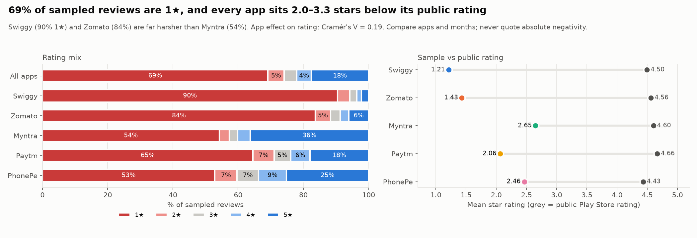

- 69.2% of reviews are 1 star and 17.5% are 5 star.
- Every app's average rating in our sample is 2.0 to 3.3 stars below its public rating.
- Business meaning: these numbers must not be reported as "user satisfaction". They are useful for ranking problems and comparing apps, which is what we do.

### Finding 2: Each app has its own type of problem

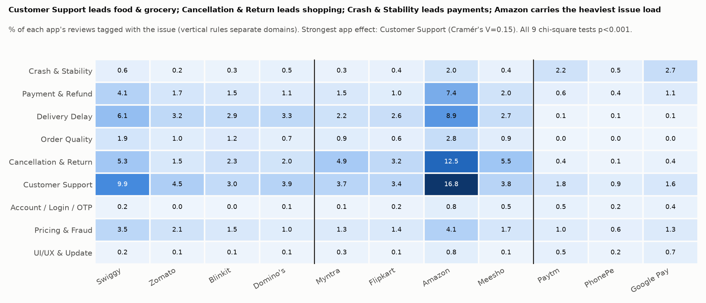

- Customer Support is the most common issue overall: 34.4% of reviews, with an average rating of 1.19 stars. It is 48% at Swiggy and 45% at Zomato.
- Delivery Delay is about 29% at Swiggy and Zomato, but only 1 to 2% at Paytm and PhonePe.
- Cancellation and Return is 40% at Myntra.
- Crash and Stability is 17% at Paytm, against 2 to 3% at Swiggy, Zomato and Myntra.
- Order Quality is rare (6.6%) but has the lowest rating of all (1.13 stars).
- Business meaning: one common fix will not work. Each company should fix its own top problem first.

### Finding 3: The data changes suddenly in July 2026, and it is not because the apps improved

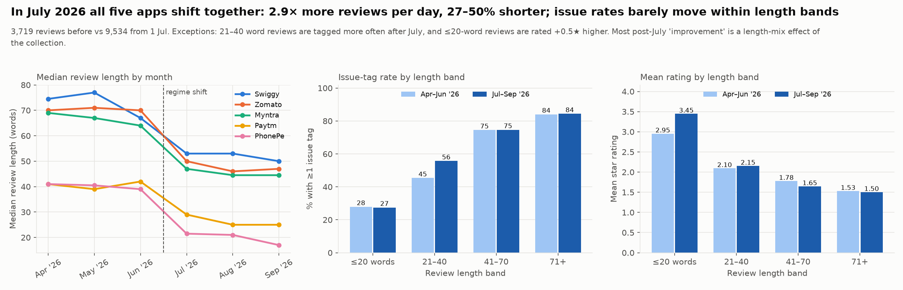

- From July 2026, all five apps have 2.9 times more reviews per day, and the reviews are 27 to 50% shorter.
- Issue rates seem to drop by 7 to 16 percentage points. But when we compare reviews of the same length, the drop is only 1 to 5 points.
- Business meaning: this is a change in what the Play Store feed returned, not a real improvement. Anyone reading the trend must know this, or they will report a false improvement.

### Other findings

- Unhappy users write about twice as much: the median is 59 words for 1-star reviews and 30 words for 5-star reviews.
- A few reviews get most of the upvotes: the top 1% of reviews hold 85% of all upvotes.
- App versions: 8 of 84 versions have a clearly lower rating than their app's average. In these versions the extra complaints are about delivery and support, not about crashes.

---

## 5. Feature Engineering and Dimensionality Reduction

Script: `scripts/05_feature_engineering.py`.

### 5.1 Method

1. TF-IDF on the review text: up to 5,000 terms, single words and two-word phrases, English stop words removed, terms must appear in at least 3 reviews and in at most 95% of reviews.
2. Truncated SVD reduces the 5,000 TF-IDF columns to 100 components.
3. The 100 text components are joined with 15 structural features.

### 5.2 Features used

| Group | Count | Features |
|---|---:|---|
| Text components | 100 | SVD components of the TF-IDF matrix |
| Issue flags | 9 | One 0/1 column for each issue category |
| Sentiment | 4 | VADER negative, neutral, positive and compound scores |
| Other | 2 | `review_length`, `thumbs_up` |
| Total | 115 | |

### 5.3 Justification

- TF-IDF gives more weight to words that are special to a review and less to words that appear everywhere.
- A 5,000-column sparse matrix is slow and noisy for a Random Forest. SVD gives a small dense matrix.
- The issue flags and sentiment scores add information that single words miss, for example whether the review is about a refund and how strongly negative it is.
- `review_length` is included because the EDA showed that longer reviews get more issue tags (Spearman 0.40). Keeping length as its own feature lets the model separate "long" from "has a problem".

### 5.4 Effect

- Text features went from 5,000 columns to 100 columns (50 times smaller).
- The 100 components keep 21.8% of the TF-IDF variance. This is normal for short, sparse text.
- Final model input: 14,988 rows and 115 columns.
- With these features both models reach a ROC-AUC of about 0.95 (Section 7).
- In the Random Forest, the most important features are the sentiment scores (compound 0.103, negative 0.093, positive 0.092), followed by the first three text components, the Customer Support flag (0.033) and review length (0.023).

We did not train a model on the full 5,000 TF-IDF columns, so we cannot say how much accuracy the reduction gained or lost. The benefit we can show is the smaller size.

---

## 6. Predictive Model Development

Script: `scripts/06_model_training.py`. Saved models are in `models/`.

| Item | Details |
|---|---|
| Prediction task | Binary classification: is the review problematic (1 or 2 stars) or not |
| Models | Logistic Regression and Random Forest |
| Data split | 80% training (11,990 reviews) and 20% testing (2,998 reviews), stratified, random state 42 |
| Logistic Regression settings | `class_weight="balanced"`, `max_iter=1000` |
| Random Forest settings | 200 trees, `class_weight="balanced"` |
| Tuning | Default values were used for the other parameters. No grid search was done. |

### Why these two models

- Logistic Regression is a simple and fast baseline. Its coefficients show the direction of each feature.
- Random Forest can learn non-linear patterns and combinations of features, and it gives feature importance.
- Using one linear and one tree-based model lets us compare two different kinds of error.
- `class_weight="balanced"` is used because 74% of the reviews are in the problematic class.

---

## 7. Model Evaluation and Result Interpretation

Scripts: `scripts/07` to `scripts/12`. Charts are in `figures/`. Full details are in `MODEL_EVALUATION.md`.

### 7.1 Results on the test set (2,998 reviews)

| Model | Accuracy | Precision | Recall | F1 | ROC-AUC | PR-AUC |
|---|---:|---:|---:|---:|---:|---:|
| Logistic Regression | 0.893 | 0.949 | 0.904 | 0.926 | 0.951 | 0.980 |
| Random Forest | 0.906 | 0.905 | 0.976 | 0.939 | 0.944 | 0.974 |

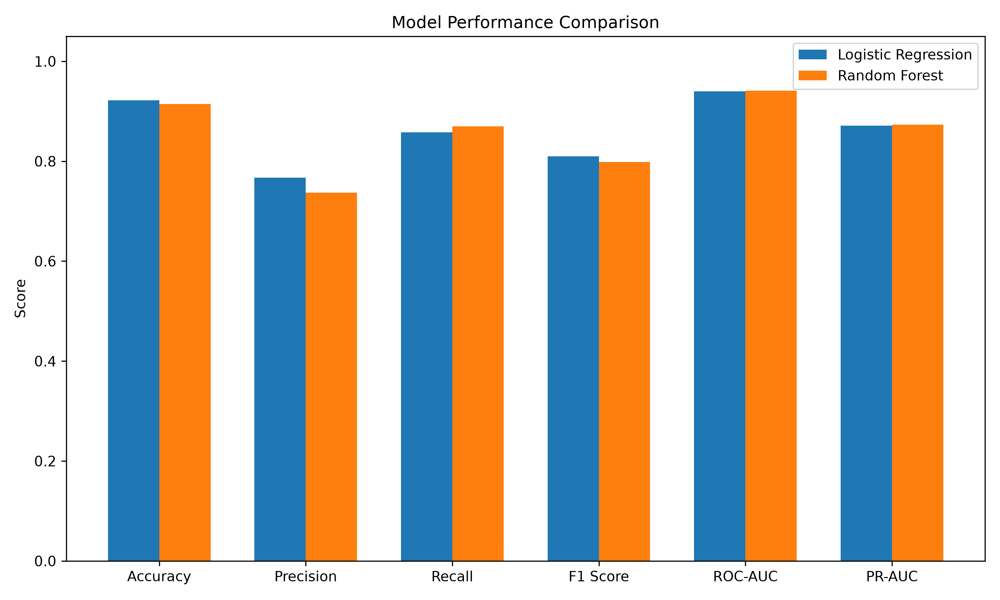

### 7.2 Confusion matrix

| Model | True negative | False positive | False negative | True positive |
|---|---:|---:|---:|---:|
| Logistic Regression | 667 | 109 | 213 | 2,009 |
| Random Forest | 547 | 229 | 53 | 2,169 |

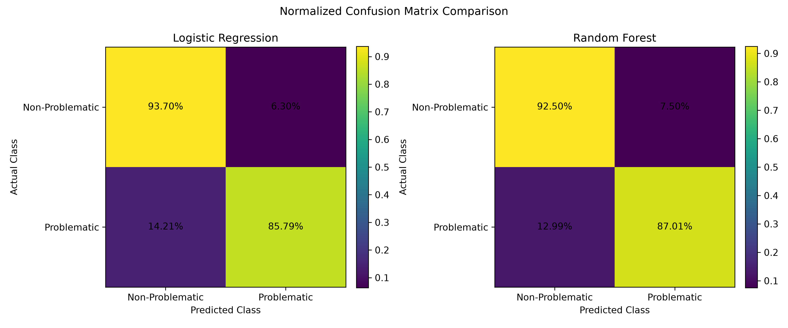

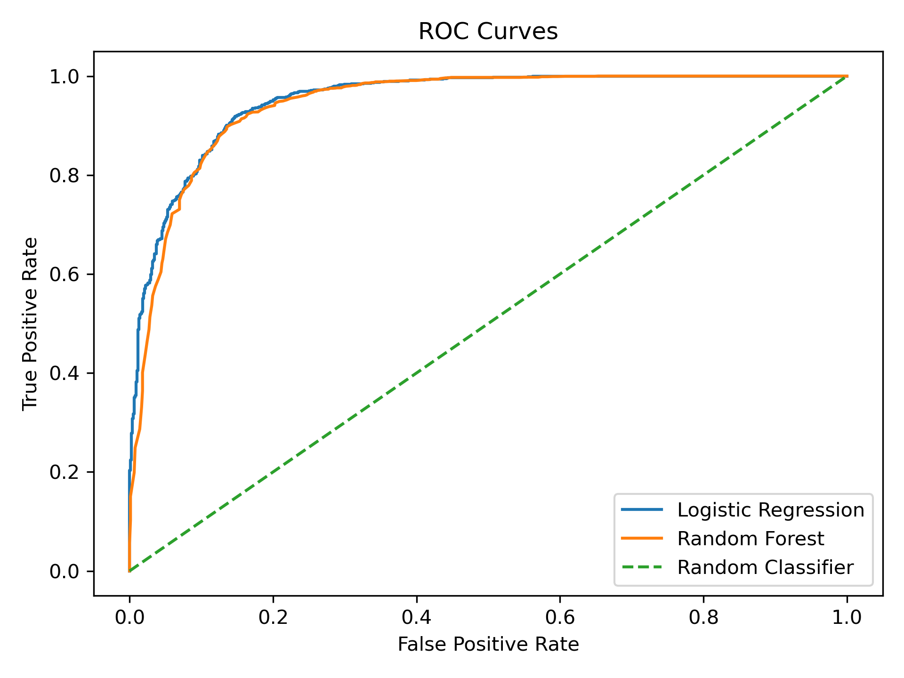

This is a classification task, so regression metrics (R squared, MAE, MSE, RMSE) do not apply to the classifier. MAE and RMSE are used later for the forecasts in Section 9.

### 7.3 Interpretation

Strengths:

- Both models separate the two classes well (ROC-AUC 0.94 to 0.95).
- A model that always says "problematic" would get 74.1% accuracy. Both models are well above this.
- The two models make different mistakes. Random Forest misses only 53 problem reviews but raises 229 false alarms. Logistic Regression raises only 109 false alarms but misses 213 problem reviews.

Limitations:

- The target comes from the star rating. The model predicts "low rating", not a confirmed app failure.
- Only one train/test split was used, with no cross-validation.
- TF-IDF, SVD and the scaler were fitted on all rows before the split. These steps do not use the target, but a stricter setup would fit them on the training rows only.
- The split is random, so it mixes reviews from before and after the July 2026 change. The scores do not tell us how the model would do on future weeks.

### 7.4 Initial business findings

- Reviews can be sorted automatically. Problem reviews can be sent to the support team without reading every review.
- If missing a complaint is costly, use Random Forest (recall 97.6%).
- If the support team is small and false alarms waste time, use Logistic Regression (precision 94.9%).
- Sentiment is the strongest signal. The way a user writes tells us a lot about the rating they will give.

---

## 8. Method 1: Text Mining

Scripts: `scripts/03_tag_issues.py` and `scripts/04_sentiment_analysis.py`. Full details are in `TEXT_MINING.md`.

### 8.1 Data preparation and implementation

Issue tagging:

- We defined 9 issue categories that fit food delivery, shopping and payment apps.
- Each category has a list of keyword patterns. If a review matches a pattern, the category is marked 1.
- A review can have more than one category. For example, a crash can lead to a double payment and then a support complaint.
- The category with the most matches becomes the `primary_issue`.

| Category | Examples of what it covers |
|---|---|
| Crash and Stability | App crashes, freezing, loading errors |
| Payment and Refund | Failed payment, money deducted, refund delay |
| Delivery Delay | Late delivery, rider delay, wrong tracking |
| Order Quality | Wrong or missing item, damaged or stale product |
| Cancellation and Return | Cannot cancel, return rejected, pickup delay |
| Customer Support | No reply, chatbot loop, ticket closed without a fix |
| Account, Login and OTP | OTP not received, login failure, blocked account |
| Pricing and Fraud | Hidden fees, overcharging, coupon not applied |
| UI/UX and Update | Bad update, confusing screen, too many ads |

Sentiment scoring:

- We used VADER from the NLTK library. It is rule-based and made for short informal text. It handles capital letters, exclamation marks and words like "very".
- It needs no training, so it cannot leak information into the classifier.
- Each review gets a compound score from -1 to +1. The label is Negative if the score is -0.05 or below, Positive if it is +0.05 or above, and Neutral in between.

### 8.2 Evaluation and interpretation

Issue tagging results:

- 9,801 of 14,988 reviews (65.4%) have at least one issue tag. On average a review has 1.12 tags.

| Issue | Reviews | % of all reviews | Mean sentiment | Average rating |
|---|---:|---:|---:|---:|
| Customer Support | 5,150 | 34.4 | -0.331 | 1.19 |
| Cancellation and Return | 2,923 | 19.5 | -0.348 | 1.56 |
| Delivery Delay | 2,301 | 15.4 | -0.437 | 1.23 |
| Payment and Refund | 2,278 | 15.2 | -0.379 | 1.27 |
| Pricing and Fraud | 1,414 | 9.4 | -0.445 | 1.30 |
| Order Quality | 996 | 6.6 | -0.504 | 1.13 |
| Crash and Stability | 938 | 6.3 | -0.102 | 1.71 |
| UI/UX and Update | 364 | 2.4 | +0.139 | 2.71 |
| Account, Login and OTP | 356 | 2.4 | -0.170 | 1.49 |

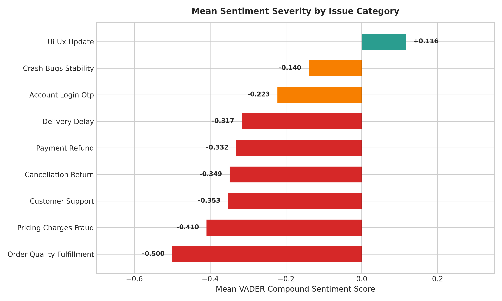

Sentiment validation against star ratings:

- Pearson correlation between the sentiment score and the rating: 0.60.
- Spearman correlation: 0.56.
- The sentiment label matches the rating class (1-2 stars negative, 3 stars neutral, 4-5 stars positive) for 72.0% of reviews.

| Rating | Reviews | Mean sentiment | % Negative | % Positive |
|---|---:|---:|---:|---:|
| 1 star | 10,366 | -0.355 | 71.9 | 24.1 |
| 2 stars | 742 | -0.136 | 54.7 | 35.3 |
| 3 stars | 579 | +0.069 | 41.3 | 49.7 |
| 4 stars | 673 | +0.399 | 19.0 | 74.4 |
| 5 stars | 2,628 | +0.673 | 6.7 | 90.4 |

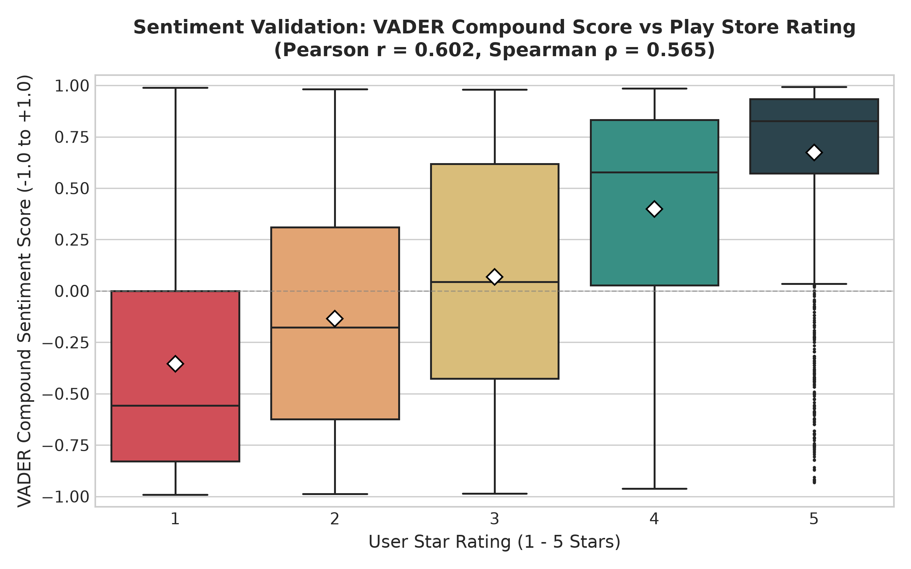

Sentiment by app:

| App | Average rating | % Negative | % Positive | Top issue |
|---|---:|---:|---:|---|
| Swiggy | 1.21 | 73.8 | 22.8 | Customer Support |
| Zomato | 1.43 | 68.5 | 27.9 | Customer Support |
| Paytm | 2.06 | 49.7 | 43.3 | Customer Support |
| Myntra | 2.65 | 47.3 | 50.9 | Cancellation and Return |
| PhonePe | 2.46 | 40.8 | 52.8 | Customer Support |

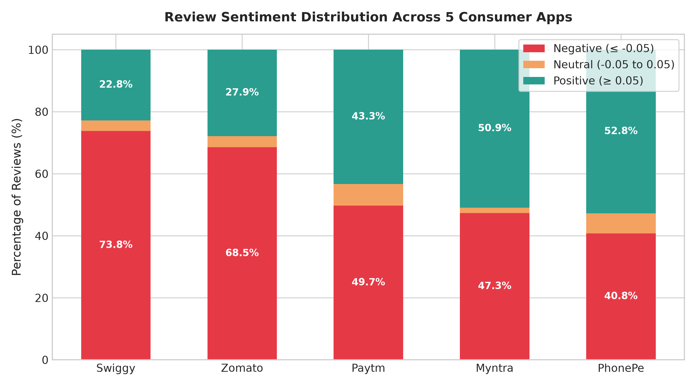

What this tells us:

- Problems with money and physical goods make users the angriest. Order Quality has the most negative sentiment (-0.504), then Pricing and Fraud (-0.445).
- Customer Support is the most common complaint in four of the five apps.
- Crash reviews use calmer, more technical language (-0.102).

Limitations of the text mining:

- 24.1% of 1-star reviews get a positive sentiment label. These are mostly sarcastic reviews, or reviews that start politely before complaining. VADER cannot detect sarcasm.
- The tagger looks for keywords and does not know if the user is praising or complaining. 333 five-star reviews are tagged Cancellation and Return, and 92% of them are Myntra users praising easy returns.
- 22% of 1-2 star reviews get no tag. Missed topics include Paytm security-scan warnings, QR scanning, notifications and rewards.

---

## 9. Method 2: Time-Series Analysis

Script: `scripts/13_time_series_forecast.py`. Full details are in `TIME_SERIES.md`.

### 9.1 Data preparation and implementation

- Input: `data/app_reviews_tagged.csv`, using the `review_date` column.
- Reviews were grouped into Monday-to-Sunday weeks, for each app and for all apps together.
- Weekly measures: number of reviews, average rating, share of 1-2 star reviews, share of negative-sentiment reviews, share of reviews with an issue tag, and the share for each of the 9 issue categories.
- Weeks with no reviews are kept with a count of 0. We did not fill them in with estimated values.
- The last week (14 to 20 September) is not complete, so it was left out.
- Modelling window: 20 April to 13 September 2026. These are the 21 complete weeks in which every app has at least 30 reviews. They contain 12,428 reviews (82.9% of the data).
- We did not forecast review volume. Each app was scraped up to a fixed 3,000 reviews, so the weekly count shows how the feed spread those reviews over time. It does not show how many reviews users actually posted.

Forecasting models (all simple and easy to explain):

| Model | How it forecasts |
|---|---|
| Naive | Same as last week |
| Mean of all history | Average of all past weeks |
| Level-shift mean | Average of the weeks after the July 2026 change |
| 4-week moving average | Average of the last 4 weeks |
| Simple exponential smoothing (SES) | Weighted average that gives more weight to recent weeks |

Why not ARIMA or seasonal models: 21 weeks is too short. There is no full year to learn seasonality from, and there is a sudden level change in the middle of the series.

Test setup:

- The last 6 weeks (3 August to 13 September) were held out as the test period.
- Each test week was forecast 1, 2, 3 and 4 weeks ahead, using only the weeks before it.
- No test week is used in training, so there is no data leakage.
- Error measures: MAE, RMSE, bias, and skill compared with the naive forecast.
- Final forecast: SES, for the 4 weeks starting 14 September, 21 September, 28 September and 5 October 2026, with an 80% prediction interval.

### 9.2 Evaluation and interpretation

Weekly trend:

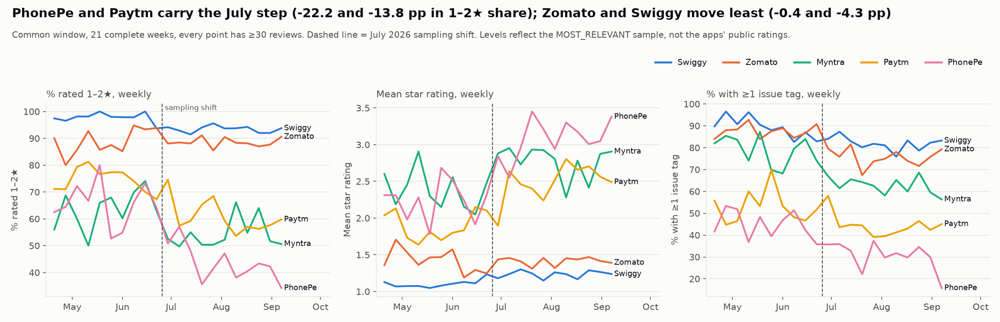

| Series | % rated 1-2 stars, before July | After July | Change |
|---|---:|---:|---:|
| Swiggy | 97.8 | 93.4 | -4.3 |
| Zomato | 88.9 | 88.5 | -0.4 |
| Myntra | 63.6 | 54.3 | -9.3 |
| Paytm | 74.5 | 60.8 | -13.8 |
| PhonePe | 65.7 | 43.5 | -22.2 |
| All apps | 77.9 | 71.1 | -6.8 |

- The weekly series shows one step down around 1 July 2026 and is then flat.
- After the step, no app shows a statistically significant trend in rating, 1-2 star share, sentiment or issue rate.
- As explained in Section 4, most of the step comes from the change in sampling.

Forecast accuracy on the 6 test weeks (MAE in percentage points for the share of 1-2 star reviews, 1 to 4 weeks ahead):

| Series | Naive | All-history mean | Level-shift mean | 4-week average | SES |
|---|---:|---:|---:|---:|---:|
| Swiggy | 1.31 | 2.98 | 0.85 | 1.03 | 1.16 |
| Zomato | 2.06 | 1.25 | 1.21 | 1.18 | 1.23 |
| Myntra | 7.94 | 6.74 | 5.73 | 6.65 | 7.06 |
| Paytm | 5.04 | 13.13 | 6.13 | 5.35 | 4.77 |
| PhonePe | 5.04 | 17.72 | 5.97 | 4.89 | 5.34 |
| All apps | 2.65 | 5.85 | 2.68 | 2.75 | 3.05 |


- SES beats the naive forecast in 19 of the 24 series we tested (6 series and 4 measures).
- The level-shift mean has the best average rank (2.04), then the 4-week average (2.29), then SES (2.67). The differences among these three are small.
- The mean of all history is the worst model in 18 of 24 series, because it ignores the July change.
- For Swiggy and Zomato the error is about 1 point. This is as low as the weekly sample size allows.
- The 80% intervals are on the safe side: 92% of the actual test values fall inside them.

Forecast for the next 4 weeks (SES):

| Series | % rated 1-2 stars | 80% interval at week 4 | Average rating |
|---|---:|---|---:|
| Swiggy | 93.2 | 89.0 to 97.4 | 1.25 |
| Zomato | 88.6 | 84.8 to 92.5 | 1.41 |
| Myntra | 58.1 | 45.3 to 70.9 | 2.74 |
| Paytm | 58.7 | 46.5 to 71.0 | 2.54 |
| PhonePe | 38.2 | 17.0 to 59.4 | 3.23 |
| All apps | 67.9 | 61.5 to 74.2 | 2.20 |

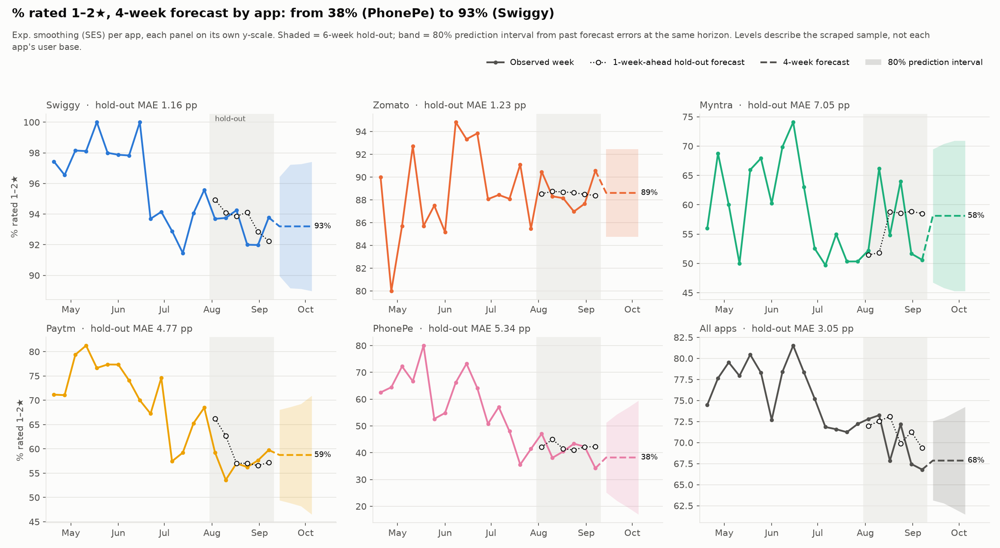

Search for sudden spikes:

- For each app, each issue and each week, we checked whether the issue rate was far above that app's normal rate.
- Only 1 of 523 cases was flagged (Swiggy, Order Quality, week of 29 June), and about 1 would be expected by chance. So no failure spike linked to a release is visible.

Limitations of the time-series analysis:

- Only 21 weeks of data, with one sudden change in the middle.
- The forecast is a flat line. It gives the expected level, not a rise or fall.
- The forecast holds only if the Play Store feed keeps behaving as it has since July.
- Weekly samples are small (38 to 312 reviews per app), so 1 to 4 points of error is unavoidable.

---

## 10. Combined Business Insights and Recommendations

### 10.1 What the methods say together

- Text Mining tells us what the problems are. Time-Series tells us when they move. The classifier finds which reviews carry a problem. EDA tells us how far the data can be trusted.
- Weekly negative sentiment moves together with the weekly share of 1-2 star reviews (correlation 0.82 for all apps). So sentiment can be used as an early signal even before ratings are averaged.
- The issue mix of each app stays the same from week to week. The problems are steady and long-running. They are not short spikes.
- The one big movement in the data (July 2026) comes from how the reviews were sampled. All four stages point to this.
- The star-rating target used by the classifier is the same quantity that the time-series tracks each week (share of 1-2 star reviews). Its level is not fixed: 77.9% before July and 71.1% after.

### 10.2 Recommendations

1. Swiggy and Zomato: fix customer support first. It appears in 48% and 45% of their reviews, with an average rating of 1.19 stars. Delivery delay (about 29%) comes next.
2. Myntra: review the cancellation and return process. It appears in 40% of reviews.
3. Paytm: look into crashes and stability. This issue is in 17% of reviews, and it is the one major issue that did not fall after July (18.9% to 20.1%).
4. Treat Order Quality complaints as high priority in all apps. They are few (6.6%) but have the worst rating (1.13 stars) and the most negative sentiment.
5. Use the classifier to sort incoming reviews. Use Random Forest when no complaint should be missed and Logistic Regression when false alarms must be low.
6. Track the weekly share of 1-2 star reviews against the forecast band. A week outside the 80% band should be checked. This works well for Swiggy and Zomato, whose bands are narrow (about 4 points on each side). The band is too wide for PhonePe (about 21 points on each side).
7. Collect reviews every week using the `NEWEST` order, not one large `MOST_RELEVANT` pull. This removes the sampling problem and makes it possible to measure the effect of each app update.
8. Improve the tagger: separate praise from complaints for returns, and add patterns for security warnings, QR scanning, notifications and rewards.

---

## 11. Interactive Dashboard

Files: `dashboard/app.py`, `dashboard/utils.py`, `dashboard/charts.py`. Built with Streamlit and Plotly.

How to run:

```bash
pip install -r dashboard/requirements.txt
streamlit run dashboard/app.py
```

The dashboard reads the files already produced by the scripts. It does not run the analysis again, so it opens quickly.

Filters in the sidebar:

- App: All apps or one of the five apps
- Period: common window, 2026 to date, full history, or a custom date range
- Metric: review volume, average rating, share of 1-2 stars, share of 4-5 stars, negative sentiment, issue-tag rate, review length
- Option to hide weeks with fewer than 30 reviews

| Tab | What it shows |
|---|---|
| Overview | 12 summary numbers, app comparison chart and table. When one app is chosen it also shows that app's profile. |
| Weekly trends | The chosen metric by week, for each app or pooled, and the weekly rating mix |
| Forecast | History, 4-week forecast and 80% band, with a choice of metric, model and horizon, and the accuracy of each model |
| Sentiment and issues | Sentiment split, rating split, issue ranking, app by issue heatmap, weekly issue trend |
| Key findings | Ten main findings, with the numbers read from the saved result files |

All charts update when a filter is changed, and hovering over a chart shows the exact value and the number of reviews behind it.


---

## 12. Project Tracking

- Tool: GitHub (issues and commit history).
- Link: https://github.com/Adithya-Monish-Kumar-K/ba-capstone-app-reviews
- Stages used on the board: Backlog, To Do, In Progress, Review/Testing, Completed.
- Each stage of the pipeline was split into issues and assigned to one member. The evidence for each issue is the script, data file, chart or document listed below.

| Stage | Issues | Owner | Evidence |
|---|---|---|---|
| Data collection and cleaning | Stage 1-2 | Aditya Monish Kumar K | `scripts/01`, `scripts/02`, `data/app_reviews_raw.csv`, `data/app_reviews_clean.csv`, `DATA_SOURCES.md` |
| Text mining | #101 to #103 | Regella Krishna Saketh | `scripts/03`, `scripts/04`, `data/app_reviews_tagged.csv`, `data/charts/`, `TEXT_MINING.md` |
| Exploratory data analysis | #104 to #106 | Akshay KS | `scripts/05_eda.py`, `data/charts/eda/`, `data/eda_summary.json`, `EDA.md` |
| Predictive modelling | #107 to #110 | Harshini Vennela | `scripts/05_feature_engineering.py`, `scripts/06` to `scripts/12`, `models/`, `figures/`, `MODEL_EVALUATION.md` |
| Time-series | #111 | Kanishka D | `scripts/13_time_series_forecast.py`, `data/timeseries/`, `data/charts/timeseries/`, `TIME_SERIES.md` |
| Dashboard | #112 | Kanishka D | `dashboard/` |
| Slides, report and final documents | #113, #114 | Kanishka D | `docs/`, `REPORT.md`|


---

## 13. Individual Contributions

| Member | Register number | Role | Work completed | Evidence |
|---|---|---|---|---|
| Aditya Monish Kumar K | CB.SC.U4CSE23103 | Data collection and preprocessing | Wrote the Play Store scraper and collected 15,000 reviews of five apps. Removed duplicates, empty and non-English reviews. Added the month and review length fields. Wrote the data source document. | `scripts/01_scrape_reviews.py`, `scripts/02_clean_reviews.py`, `data/app_reviews_raw.csv`, `data/app_reviews_clean.csv`, `data/app_metadata.csv`, `DATA_SOURCES.md` |
| Regella Krishna Saketh | CB.SC.U4CSE23649 | Text mining | Designed the 9 issue categories and the keyword tagger. Scored sentiment with VADER and checked it against star ratings. Made 4 charts and the summary tables. | `scripts/03_tag_issues.py`, `scripts/04_sentiment_analysis.py`, `data/app_reviews_tagged.csv`, `data/charts/`, `TEXT_MINING.md` |
| Akshay KS | CB.SC.U4CSE23104 | Exploratory data analysis | Made 13 charts and ran the statistical tests. Found the sample bias and the July 2026 sampling change. Prepared the monthly and version tables used by later stages. | `scripts/05_eda.py`, `data/charts/eda/`, `data/eda_summary.json`, `data/eda/`, `EDA.md` |
| Harshini Vennela | CB.SC.U4CSE23455 | Feature engineering and predictive model | Built the TF-IDF and SVD features. Trained Logistic Regression and Random Forest. Made the confusion matrix, ROC, precision-recall and feature importance charts. | `scripts/05_feature_engineering.py`, `scripts/06` to `scripts/12`, `models/`, `figures/`, `MODEL_EVALUATION.md` |
| Kanishka D | CB.SC.U4CSE23155 | Time-series, dashboard and final assembly | Built the weekly tables and the forecasting test with five models. Built the Streamlit dashboard. Prepared the slide deck, this report, the final notebook and the contribution summary. | `scripts/13_time_series_forecast.py`, `data/timeseries/`, `data/charts/timeseries/`, `TIME_SERIES.md`, `dashboard/`, `slides/`, `REPORT.md`, `notebooks/` |

All planned work for Review 1 and Review 2 is complete. There are no pending tasks.

---

## 14. Conclusion

We collected 15,000 Play Store reviews of five Indian apps ourselves and built a complete pipeline on them: cleaning, issue tagging, sentiment scoring, exploratory analysis, a problem-review classifier, weekly forecasting and an interactive dashboard.

The main things we learned:

- Complaints are mostly about service, not about the app software. Customer support, delivery, refunds and returns come up far more often than crashes.
- Each app has a clear and steady problem profile. Swiggy and Zomato: support and delivery. Myntra: returns. Paytm: stability.
- A simple classifier can find problem reviews with an F1 score of about 0.93, using the review text, the issue tags and the sentiment scores.
- VADER sentiment agrees reasonably well with star ratings (correlation 0.60), and at the weekly level it moves closely with the share of low ratings.
- The weekly share of negative reviews can be forecast within about 1 to 7 percentage points using simple models. The forecast is a level, not a trend.
- The way data is collected matters as much as the model. The largest change in our data, in July 2026, was caused by sampling. Without the EDA check we would have reported a false improvement.


---

## 15. How to Reproduce

```bash
pip install google-play-scraper pandas numpy scipy scikit-learn nltk matplotlib seaborn joblib

python scripts/01_scrape_reviews.py          # collect reviews (gives fresh data)
python scripts/02_clean_reviews.py           # clean
python scripts/03_tag_issues.py              # issue tags
python scripts/04_sentiment_analysis.py      # VADER sentiment
python scripts/05_eda.py                     # EDA charts and summary
python scripts/05_feature_engineering.py     # TF-IDF, SVD, scaling
python scripts/06_model_training.py          # train and evaluate models
python scripts/13_time_series_forecast.py    # weekly tables, forecasts, charts

pip install -r dashboard/requirements.txt
streamlit run dashboard/app.py               # dashboard
```


---

## 16. References

[1] D. Pagano and W. Maalej, "User feedback in the AppStore: An empirical study," IEEE International Requirements Engineering Conference (RE), 2013.

[2] N. Chen, J. Lin, S. C. H. Hoi, X. Xiao and B. Zhang, "AR-Miner: Mining informative reviews for developers from mobile app marketplace," International Conference on Software Engineering (ICSE), 2014.

[3] E. Guzman and W. Maalej, "How do users like this feature? A fine grained sentiment analysis of app reviews," IEEE International Requirements Engineering Conference (RE), 2014.

[4] W. Maalej and H. Nabil, "Bug report, feature request, or simply praise? On automatically classifying app reviews," IEEE International Requirements Engineering Conference (RE), 2015.

[5] C. J. Hutto and E. Gilbert, "VADER: A parsimonious rule-based model for sentiment analysis of social media text," International AAAI Conference on Weblogs and Social Media (ICWSM), 2014.

[6] R. J. Hyndman and G. Athanasopoulos, Forecasting: Principles and Practice, 3rd edition, OTexts, 2021.
