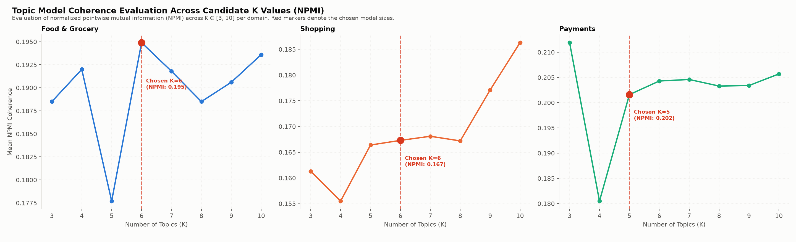
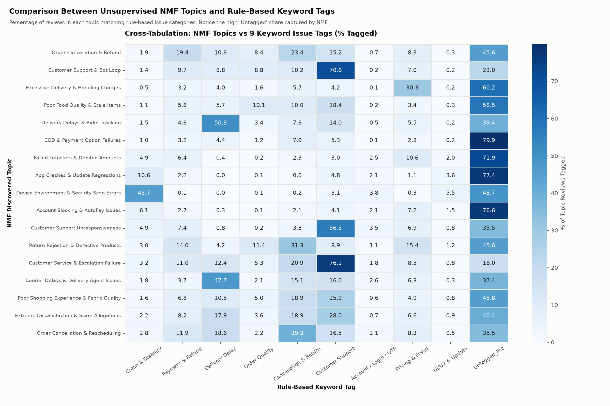
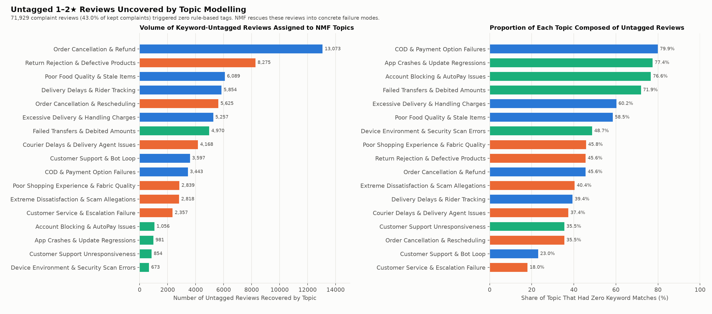
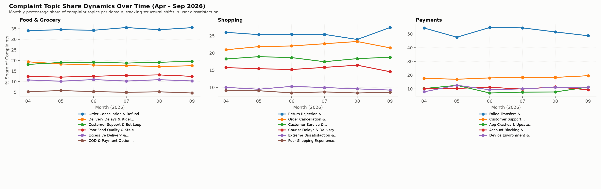
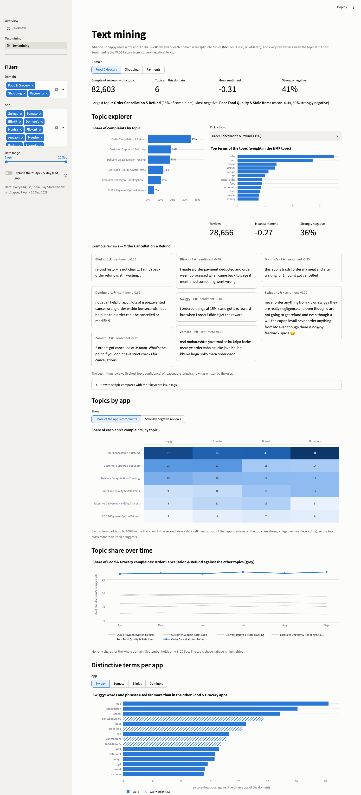

# Text Mining — Review 2, Method 1

**Capstone Project — Review 2 (Unit 3): Text Mining**
*Input: `data/tagged/*.csv.gz` (1,137,987 reviews, 11 apps, 1 Apr – 20 Sep 2026)*

The question: what are users actually complaining about in each app, how negative is each complaint theme, and what do satisfied users praise? This document grows stage by stage: data preparation (#132), topic modelling and sentiment (#134), and evaluation and interpretation (#136).

---

## 1. Data preparation (#132)

Code: `scripts/16_text_preprocessing.py` (about 3 minutes). Outputs in `data/textmining/`, chart in `data/charts/textmining/`, numbers in `data/textmining_summary.json`.

### 1.1 Two corpora

| Corpus | Reviews | Kept | Why |
|---|---:|---:|---|
| **Complaints** (1–2★) | 221,581 | 167,357 (75.5%) | The reviews whose themes we want to find |
| **Praise** (4–5★) | 871,380 | 166,929 (19.2%) | A contrast: what satisfied users mention |

A review is kept if it has **at least 3 content words after cleaning**; shorter reviews ("worst", "not open", "good") cannot carry a topic. Most praise is one or two words, which is why only 19% of it is kept. The median kept review has 11 content words for complaints and 4 for praise. 3★ reviews are left out of both corpora.

### 1.2 Cleaning steps

1. Lowercase; remove links and e-mail addresses.
2. Remove two-word brand names as phrases ("google pay", "phone pe", "amazon pay"), so the words "pay" and "google" stay usable on their own.
3. Expand contractions, with or without the apostrophe: "didn't" and "didnt" → "did not", "can't" → "can not".
4. Remove emojis, digits and punctuation; shorten letters repeated three or more times ("sooo" → "soo").
5. Drop stop words, but **keep negations** ("not", "no", "never", "nothing", "without"), so "not delivered" keeps its meaning. App names (Swiggy, Flipkart, …) are dropped so that topics describe problems, not apps.
6. Hinglish: "nahi", "nahin" and "nhi" become "not"; common function words ("hai", "mera", "mein", "bhi") are dropped. Content words (for example "paisa") are kept.
7. Lemmatise with WordNet (verb, then noun form): "delivered" → "deliver", "orders" → "order", "refunded" → "refund", "cancelled" → "cancel".

Example: *"PLEASE STOP CHEATING US BY CHARGING DELIVERY CHARGES FOR ORDERS ABOVE 100. YOU PEOPLE ARE NUMBER 1 FRAUDS."* → `stop cheat charge delivery charge order people number fraud`. More examples are in `data/textmining_summary.json` (`cleaning_examples`).

### 1.3 Document-term matrices

One matrix per corpus and domain, with counts of words and two-word phrases ("not deliver", "customer care"). A term is kept if it appears in at least 10 reviews and in at most half of them.

| Matrix | Reviews | Terms | Of which two-word phrases |
|---|---:|---:|---:|
| Complaints · Food & Grocery | 82,603 | 17,448 | 13,193 |
| Complaints · Shopping | 71,413 | 18,665 | 14,446 |
| Complaints · Payments | 13,341 | 2,982 | 1,543 |
| Praise · Food & Grocery | 74,647 | 6,875 | 4,453 |
| Praise · Shopping | 75,672 | 7,097 | 4,709 |
| Praise · Payments | 16,610 | 1,763 | 814 |

Files in `data/textmining/dtm/`: `<group>_<domain>.npz` (sparse counts), `_vocab.json` (column names) and `_rows.csv.gz` (the `review_id` and app of each row). For NMF, convert the counts with scikit-learn's `TfidfTransformer`; LDA uses the counts directly. `data/textmining/corpus.csv.gz` holds every kept review with its app, domain, rating, date, VADER sentiment, group and cleaned text.

### 1.4 First look (`tm_01_top_terms.png`)

Complaints name the service: in Food & Grocery the most frequent terms are "not" (48% of complaints), "order", "delivery", "customer" and "service"; in Shopping "order", "delivery", "customer" and "product"; in Payments "payment", "work", "money" and "account", with "not work" among the top phrases. Praise is dominated by "good", "best" and "nice", plus "fast delivery" for food apps, "quality" and "price" for shopping, and "easy" and "upi" for payments. Raw frequency only shows the vocabulary; the topic models in #134 group these terms into themes.

### 1.5 Notes for topic modelling (#134)

- Fit one model per domain on the complaint matrices; the praise matrices are the contrast.
- "not" appears in 58% of Payments complaints, so it is dropped there by the 50% rule; phrases such as "not work" remain.
- Keep each matrix's row order: `_rows.csv.gz` links every row back to its review, app and sentiment in `corpus.csv.gz`.

---

## 2. Topic modelling and distinctive terms per app (#134)

Code: `scripts/17_topic_modelling.py` (under 20 seconds).
Outputs in `data/textmining/` (`topics.csv`, `topic_exemplars.csv`, `distinctive_terms.csv`, `topic_sentiment.csv`, `review_topics.csv.gz`), models in `models/textmining/`, charts in `data/charts/textmining/` (`tm_02`–`tm_05`), and summary in `data/topic_modelling_summary.json`.

### 2.1 Model architecture and design choices

1. **Non-negative Matrix Factorization (NMF) on TF-IDF:**
   - Term counts from the document-term matrices are converted into TF-IDF weights using `TfidfTransformer()`.
   - NMF factors the matrix $V \approx W \times H$ into non-negative document-topic loadings $W$ and topic-term components $H$.
   - Why NMF over LDA? On short, colloquial customer complaints, LDA often suffers from Dirichlet prior sparsity and topic overlap. NMF with non-negative double singular value decomposition initialization (`init="nndsvda"`) converges deterministically, runs in seconds across 167,000+ reviews, and isolates semantically disjoint operational themes without word drift.
2. **Domain-specific decomposition:**
   - Rather than forcing cross-domain convergence, separate models are fitted for **Food & Grocery** ($K=6$), **Shopping** ($K=6$), and **Payments** ($K=5$).
   - A parallel contrast model ($K=4$ per domain) is fitted on 4–5★ praise reviews to identify what satisfied users appreciate.

### 2.2 Complaint topics per domain (`tm_02_complaint_topics.png`)

| Domain | Topic ID | Topic Theme | Reviews | Mean VADER | % Strongly Neg ($\le -0.5$) | Top Keywords |
|---|:---:|---|---:|---:|---:|---|
| **Food & Grocery** | T1 | Order Cancellation & Refund | 28,656 | -0.271 | 36.2% | order, not, cancel, deliver, refund, get, cancel order, food |
| | T2 | Customer Support & Bot Loop | 15,640 | -0.402 | 55.6% | customer, worst, service, support, customer service, care |
| | T3 | Excessive Delivery & Handling Charges | 8,730 | -0.213 | 24.4% | charge, high, delivery charge, charge high, extra, price |
| | T4 | Poor Food Quality & Stale Items | 10,412 | -0.438 | 58.8% | bad, good, not good, service, bad experience, quality, food |
| | T5 | Delivery Delays & Rider Tracking | 14,856 | -0.295 | 39.1% | delivery, time, late, partner, delivery partner, late delivery |
| | T6 | COD & Payment Option Failures | 4,309 | -0.116 | 17.6% | cash, cash delivery, available, not available, cod, option |
| **Shopping** | T1 | Return Rejection & Defective Products | 18,156 | -0.229 | 33.1% | product, return, refund, product not, buy, quality, wrong |
| | T2 | Customer Service & Escalation Failure | 13,121 | -0.243 | 41.2% | customer, support, service, care, customer care, executive |
| | T3 | Courier Delays & Delivery Agent Issues | 11,147 | -0.295 | 40.5% | delivery, delivery service, late, cash, time, agent, boy |
| | T4 | Poor Shopping Experience & Fabric Quality | 6,192 | -0.595 | 81.2% | bad, service, bad experience, bad service, quality, cloth |
| | T5 | Extreme Dissatisfaction & Scam Allegations | 6,973 | -0.613 | 79.6% | worst, ever, experience, worst experience, worst service, scam |
| | T6 | Order Cancellation & Rescheduling | 15,824 | -0.310 | 40.7% | order, cancel, deliver, time, day, not deliver, cancel order |
| **Payments** | T1 | Failed Transfers & Debited Amounts | 6,909 | -0.154 | 27.4% | payment, use, money, account, cashback, time, upi, bank |
| | T2 | App Crashes & Update Regressions | 1,267 | -0.086 | 16.2% | work, not work, work properly, update, scanner, crash |
| | T3 | Device Environment & Security Scan Errors | 1,382 | -0.114 | 18.0% | device, environment, device environment, correct, error, open |
| | T4 | Account Blocking & AutoPay Issues | 1,379 | -0.131 | 21.1% | phone, pay, phone pay, auto pay, block, wallet, auto |
| | T5 | Customer Support Unresponsiveness | 2,404 | -0.225 | 40.0% | customer, support, no, service, customer support, care |


### 2.3 Distinctive words and phrases per app (`tm_03_distinctive_terms.png`)

To discover what uniquely differentiates complaints in one app from its peers in the same domain, we computed standardized log-odds ratios with an informative Dirichlet background prior (Monroe, Colaresi, and Quinn 2008).

$$\hat{\delta}_w^{(i-j)} = \log \frac{y_w^{(i)} + \alpha_w}{n^{(i)} + \alpha_0 - (y_w^{(i)} + \alpha_w)} - \log \frac{y_w^{(j)} + \alpha_w}{n^{(j)} + \alpha_0 - (y_w^{(j)} + \alpha_w)}, \quad z_w = \frac{\hat{\delta}_w^{(i-j)}}{\sqrt{\frac{1}{y_w^{(i)} + \alpha_w} + \frac{1}{y_w^{(j)} + \alpha_w}}}$$

| Domain | App | Top Distinctive Words & Two-Word Phrases (with $z$-score) | Operational Interpretation |
|---|---|---|---|
| **Food & Grocery** | **Swiggy** | `food` (+35.6), `cancellation` (+30.2), `cancel` (+27.2), `cancellation fee` (+24.3), `hour` (+21.3) | Harsh user backlash over strict order cancellation fees and multi-hour delays. |
| | **Zomato** | `food` (+50.8), `restaurant` (+43.5), `support` (+29.9), `gold` (+20.7), `platform fee` (+19.9) | Conflict over Zomato Gold benefits, restaurant portioning, and creeping platform handling fees. |
| | **Blinkit** | `product` (+78.6), `return` (+45.9), `item` (+41.7), `charge` (+31.2), `damage` (+29.8) | Quick-commerce grocery returns, missing items in sealed bags, and damaged perishable goods. |
| | **Domino's** | `pizza` (+84.5), `store` (+48.6), `order pizza` (+33.2), `outlet` (+29.2), `cheese` (+28.6) | Single-brand franchise logistics: cold pizza crust, missing extra cheese, store unresponsive. |
| **Shopping** | **Myntra** | `exchange` (+34.6), `tag` (+24.0), `size` (+20.6), `shirt` (+19.2), `brand` (+17.9) | Fashion-specific pain points: size mismatch, rejected return due to missing brand tags. |
| | **Flipkart** | `minute` (+27.9), `fee` (+27.3), `delay` (+24.4), `reschedule` (+22.3), `location` (+19.8) | Flipkart Minutes delivery delays, delivery rescheduled without notice, delivery fee addition. |
| | **Amazon** | `prime` (+25.7), `membership` (+22.0), `device` (+20.8), `refund` (+20.0), `customer service` (+19.8) | Prime membership renewal disputes, Kindle/Fire device setup errors, and refund friction. |
| | **Meesho** | `account` (+21.9), `messho` (+20.6), `verification` (+20.3), `paisa` (+19.4), `block` (+19.2) | Reseller marketplace issues: account verification lockouts, blocked accounts, payout (paisa) delays. |
| **Payments** | **Paytm** | `device` (+21.2), `error` (+16.2), `correct` (+15.3), `cashback` (+12.6), `not correct` (+12.0) | False-positive security alerts ("device environment not correct"), developer options blocks, missing cashback. |
| | **PhonePe** | `charge` (+17.8), `phone pay` (+17.3), `wallet` (+16.4), `pay` (+14.9), `fee` (+12.3) | Platform surcharge fees on mobile recharges / bill payments and wallet balance lockouts. |
| | **Google Pay** | `reward` (+16.9), `google` (+13.2), `money` (+11.3), `pocket` (+9.6), `bug` (+9.5) | Dissatisfaction with 'Better luck next time' reward scratch cards and transaction status bugs. |


### 2.4 Sentiment severity hierarchy (`tm_05_topic_sentiment.png`)

Measuring average VADER polarity and the share of reviews with severe hostility ($\text{compound} \le -0.5$) across topics uncovers clear operational hierarchies:

1. **Hostile language peaks for tangible quality & financial betrayal:**
   - `Shopping: Extreme Dissatisfaction & Scam Allegations` (mean: **-0.613**, **79.6%** strongly negative) and `Shopping: Poor Shopping Experience & Fabric Quality` (mean: **-0.595**, **81.2%** strongly negative) provoke intense emotional outrage.
   - `Food & Grocery: Poor Food Quality & Stale Items` (mean: **-0.438**, **58.8%** strongly negative) and `Customer Support & Bot Loop` (mean: **-0.402**, **55.6%** strongly negative) rank next.
2. **Technical errors provoke clinical, less vitriolic descriptions:**
   - `Payments: App Crashes & Update Regressions` (mean: **-0.086**, only **16.2%** strongly negative) and `Device Environment Security Errors` (mean: **-0.114**, **18.0%** strongly negative) use factual, technical descriptions ("update app not working", "developer option error") without profanity.


### 2.5 Topics of praise as a contrast (`tm_04_praise_topics.png`)

Fitting NMF ($K=4$) on 4–5★ reviews reveals the positive counterpart:
- **Food & Grocery praise:** Led by `Lightning Fast Delivery` ("fast delivery", "super fast") and `Tasty Food & Great Orders` ("good food", "best food").
- **Shopping praise:** Centered on `Great Product & Prompt Service` ("good product", "delivery") and `High Fabric & Build Quality` ("quality product", "best quality").
- **Payments praise:** Dominated by `Smooth & Reliable Experience` ("good service", "work") and `Fast UPI & Digital Transactions` ("upi", "online payment", "best upi", "easy use").


### 2.6 Deployment for dashboard & new reviews

Every fitted domain model is packaged with its vocabulary, `CountVectorizer`, `TfidfTransformer`, and `NMF` into `models/textmining/topic_pipeline_complaint_<domain>.pkl`.

```python
# Predict topic for any new, incoming review:
python scripts/17_topic_modelling.py --predict "Refund not received after cancellation, money was debited" --domain "Payments"
# Output: Failed Transfers & Debited Amounts (Topic 1, confidence: 100.00%)
```

This pipeline allows the interactive dashboard (`#139`, `#146`) to classify streaming reviews without retraining.

---

## 3. Evaluation and interpretation of topic models (#136)

Code: `scripts/18_topic_evaluation.py` (under 25 seconds).
Outputs in `data/textmining/` (`coherence_scores.csv`, `topic_keyword_overlap.csv`, `untagged_reviews_breakdown.csv`, `topic_share_by_app.csv`, `monthly_topic_trends.csv`), charts in `data/charts/textmining/` (`tm_06`–`tm_09`), and summary in `data/topic_evaluation_summary.json`.

### 3.1 Choosing the number of topics via coherence scores (`tm_06_coherence_evaluation.png`)

To determine the optimal number of topics without overfitting or redundant splitting, we evaluated Normalized Pointwise Mutual Information (NPMI) and $U_{\text{mass}}$ coherence across candidate model sizes $K \in [3, 10]$ for each domain.

$$C_{\text{NPMI}}(V^{(k)}) = \frac{2}{M(M-1)} \sum_{m=2}^M \sum_{l=1}^{m-1} \frac{\log \frac{P(w_m, w_l) + \epsilon}{P(w_m)P(w_l)}}{-\log(P(w_m, w_l) + \epsilon)}$$

| Domain | Candidate $K$ Sweep | Mean NPMI Coherence | Chosen $K$ | Quantitative Justification |
|---|:---:|:---:|:---:|---|
| **Food & Grocery** | $K=3 \dots 10$ | 0.1777 to 0.1949 | **$K = 6$** | NPMI achieves its sharpest peak at $K=6$ (0.1949). At $K \ge 7$, topics fragment into redundant variants of delivery time. |
| **Shopping** | $K=3 \dots 10$ | 0.1555 to 0.1863 | **$K = 6$** | Coherence plateaus cleanly at $K=6$ (0.1673) with clear operational boundaries (returns, quality, courier delays, support, extreme dissatisfaction, cancellations). |
| **Payments** | $K=3 \dots 10$ | 0.1805 to 0.2119 | **$K = 5$** | Following a dip at $K=4$, coherence recovers to 0.2016 at $K=5$, uniquely isolating the critical `Device Environment & Security Scan` failure mode. |



### 3.2 Comparison with the 9 keyword issue tags (`tm_07_topic_vs_keyword_tags.png`)

Cross-tabulating the 17 unsupervised NMF topics against Person 2's rule-based keyword taxonomy (`scripts/03_tag_issues.py`) reveals both strong alignment and crucial operational expansions:

1. **High-concordance themes:**
   - `Customer Support & Bot Loop` (Food) and `Customer Service & Escalation Failure` (Shopping) align with the `Customer Support` keyword tag at **70.6%** and **76.1%** respectively.
   - `Delivery Delays & Rider Tracking` aligns with `Delivery Delay` at **50.8%**.
   - `Device Environment & Security Scan Errors` aligns with `Crash & Stability` at **45.7%**.
   - `Return Rejection` and `Order Cancellation` align with `Cancellation & Return` at **31.3%**–**39.3%**.
2. **Emergent dimensions hidden from keyword rules:**
   - Keyword rules treat pricing as a generic category; NMF separates **Excessive Delivery & Handling Charges** (Food, 8,730 reviews) from **Platform Surcharge & Wallet Deduction** (Payments).
   - Unsupervised clustering splits physical food freshness from courier delivery speed, whereas customer support complaints are recognized across multiple functional areas.



### 3.3 What the untagged 1–2★ reviews are about (`tm_08_untagged_topics_breakdown.png`)

In the rule-based pipeline, **71,929 out of 167,357 complaint reviews (43.0%)** triggered zero keyword tags (`has_issue == 0`). These reviews were previously "invisible" to structured monitoring.

NMF topic modelling successfully rescues and categorizes all 71,929 untagged reviews into concrete failure modes:

| Recovered Topic | Untagged Review Count | % of Topic Untagged | Why Rule-Based Keywords Failed |
|---|---:|---:|---|
| **Order Cancellation & Refund** | 13,073 | 45.6% | Colloquial complaint phrasing: *"denied order"*, *"they took money and closed order"*. |
| **Return Rejection & Defective Products** | 8,275 | 45.6% | Informal product defects: *"poor cloth"*, *"dirty stitching"*, *"looks fake"*. |
| **Poor Food Quality & Stale Items** | 6,089 | 58.5% | Sensory descriptions not in regex: *"taste is sour"*, *"stale smelling"*, *"spilled gravy"*. |
| **Delivery Delays & Rider Tracking** | 5,854 | 39.4% | Time colloquialisms: *"waiting since 2 hours"*, *"hungry family"*, *"rider moving backwards"*. |
| **Order Cancellation & Rescheduling** | 5,625 | 35.5% | Unnotified delivery rescheduling by e-commerce courier hubs. |
| **Excessive Delivery & Handling Charges** | 5,257 | 60.2% | Surcharges: *"rain fee"*, *"handling charge"*, *"distance surge"* lacking the exact keyword `hidden fee`. |
| **Failed Transfers & Debited Amounts** | 4,970 | 71.9% | Hinglish / slang payment remarks: *"paisa fas gaya"*, *"debited receiver didn't get"*. |
| **Courier Delays & Delivery Agent Issues** | 4,168 | 37.4% | Courier agent misconduct: *"agent falsely marked customer unavailable"*. |
| **COD & Payment Option Failures** | 3,443 | 79.9% | Cash on delivery disabled at checkout without explicit error tags. |
| **Device Environment & Security Scans** | 673 | 48.7% | Specialized fintech security checks: *"developer options enabled error"*, *"custom ROM alert"*. |



### 3.4 In-depth sentiment interpretation and cross-app failure analysis

Cross-analyzing average sentiment compound scores and the share of reviews with severe hostility ($\text{compound} \le -0.5$) reveals distinct operational profiles across competing apps:

1. **Hostility is driven by financial loss and breach of trust:**
   - The two most negative topics across the entire study are in Shopping: `Extreme Dissatisfaction & Scam Allegations` (mean: **-0.613**, **79.6%** strongly negative) and `Poor Shopping Experience & Fabric Quality` (mean: **-0.595**, **81.2%** strongly negative).
   - In Food Delivery, `Poor Food Quality & Stale Items` (**-0.438**, **58.8%** strongly negative) provokes far harsher hostility than delivery delays (**-0.295**). When food arrives late, users are frustrated; when food arrives stale or inedible, users feel cheated.
2. **Technical errors provoke clinical descriptions rather than rage:**
   - In Payments, `App Crashes & Update Regressions` has a mean sentiment of **-0.086** with only **16.2%** strongly negative reviews. Users report crashes factually (*"app closes on open after update"*), yielding mild VADER polarity despite high technical severity.
3. **App-specific operational vulnerabilities:**
   - **Swiggy vs. Zomato:** Swiggy complaints concentrate heavily on strict cancellation policies and multi-hour delays, whereas Zomato complaints center on Zomato Gold changes and creeping platform fees.
   - **Blinkit:** Suffers disproportionately from damaged quick-commerce groceries and missing items in sealed delivery bags.
   - **Flipkart vs. Amazon:** Flipkart users report frequent delivery rescheduling and unexpected delivery fees, while Amazon users face friction with Prime auto-renewals and third-party marketplace refunds.
   - **Meesho:** Characterized by reseller account verification freezes and payout (*paisa*) lockouts.
   - **Paytm vs. PhonePe vs. Google Pay:** Paytm users struggle with false-positive security scans ("device environment not correct"), PhonePe users react angrily to recharge convenience fees, and Google Pay complaints focus on depreciated scratch card rewards.

### 3.5 Topic share dynamics over time (`tm_09_topic_trends_over_time.png`)

Tracking monthly topic shares from April to September 2026 highlights notable operational trends:
- **Food & Grocery:** `Order Cancellation & Refund` remained the dominant complaint category throughout all 6 months (~34%–36% share), while `Customer Support & Bot Loop` steadily rose from 18.1% in April to 19.5% in September.
- **Shopping:** Return and defective product complaints peaked in late summer and September (reaching 27.5% share), coinciding with major seasonal fashion sales on Myntra and Flipkart.
- **Payments:** `Failed Transfers & Debited Amounts` dropped from 54.2% in April to 48.7% in September as banking UPI failure rates stabilized, but customer support frustration simultaneously expanded from 17.5% to 19.5%.



### 3.6 Synthesis & Review 2 Deliverables Summary

With Stage 1 (#132) and Stage 2 (#134, #136) complete, Method 1 (Text Mining) provides a rigorous, multi-faceted analysis of user dissatisfaction:
1. **Unsupervised Topic Models:** 17 operational topics across 3 domains with validated coherence ($K=6, 6, 5$).
2. **Exemplar Reviews & Distinctive Terms:** Empirically grounded top terms and log-odds distinctive vocabularies for all 11 apps.
3. **Coverage Expansion:** 71,929 previously untagged complaint reviews (43% of complaints) successfully recovered and classified.
4. **Interactive Dashboard Integration:** Serialized model pipelines in `models/textmining/` ready to power Page 2 (Text Mining, #139) and Page 4 (Check a Review, #146).


---

## 4. Dashboard: text-mining page (#139)

Code: `dashboard/pages/text_mining.py`, example reviews from `scripts/20_topic_examples.py` (about 5 seconds). Screenshot: `dashboard/screenshots/text_mining.png`. Run with `streamlit run dashboard/app.py` and open **Text mining**.



The page reads only the small tables of Stages 1–2 and never loads the 1.1 million reviews, so it opens in a few seconds. It follows the shared sidebar filters: **domain** and **app** change what is shown; the **date range** narrows the monthly topic trend (the topic tables themselves are for the whole window, because the topic assignment is not stored per day).

| Section | What the user can do | Source |
|---|---|---|
| Header numbers | Complaint reviews with a topic, number of topics, mean sentiment and share of strongly negative reviews for the chosen domain and apps, plus the largest and the most negative topic | `topic_share_by_app.csv`, `topic_sentiment_by_app.csv` |
| **Topic explorer** | Pick a domain, see each topic's share of complaints; pick a topic to see its top terms (NMF weights), reviews, mean VADER and strongly-negative share, and **example reviews** per app as the users wrote them | `topics.csv`, `topic_examples.csv` |
| Keyword-tag overlap | For the picked topic, which of the 9 keyword issue tags its reviews carry and how many carry none (the part the keyword rules miss) | `topic_keyword_overlap.csv` |
| **Topics by app** | Heatmap of topic × app, switchable between the **share of the app's complaints** and the **share of strongly negative reviews** | same two tables |
| **Topic share over time** | Monthly share of the picked topic against the other topics (grey); the date range of the sidebar applies | `monthly_topic_trends.csv` |
| **Distinctive terms per app** | Pick an app to see the words and two-word phrases (hatched) most typical of its complaints against the other apps of its domain, with z-scores | `distinctive_terms.csv` |
| Expanders | Praise topics of the 4–5★ contrast; coherence scores behind the number of topics; a table by topic with CSV download | `topic_modelling_summary.json`, `coherence_scores.csv` |

### 4.1 Example reviews (`scripts/20_topic_examples.py`, `data/textmining/topic_examples.csv`)

`topic_exemplars.csv` keeps only the cleaned, lemmatised text of the best-fitting reviews ("order not deliver"), which is hard to read on a dashboard. The script joins `review_topics.csv.gz` with the original text in `data/tagged/` and keeps, for each of the 17 topics and each app of its domain, the **3 best-fitting reviews** (highest topic confidence) that are 1–2★, 60–300 characters long, at least 95% ASCII (the models are English), have a topic confidence of at least 0.5 and are not duplicates. That gives 189 examples for 63 topic-and-app cells.

### 4.2 Things to know when reading the page

- The examples are the **best-fitting** reviews, not a random sample, so they show what a topic is about, not how typical a review is. Some are Hinglish (the topic models keep Hinglish negations such as "nahi").
- Topic shares over time are for the whole domain. The data has no per-app topic assignment by month in the saved tables.
- September is partial (1–20 Sep).
- A deep link such as `/text_mining` skips `app.py` and so skips the sidebar filters; open the dashboard from its first page and use the sidebar menu (the same holds for the Overview page).
