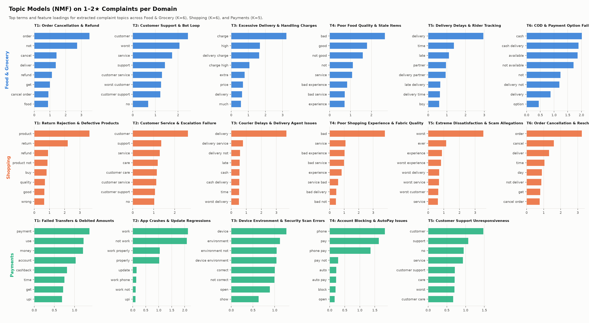
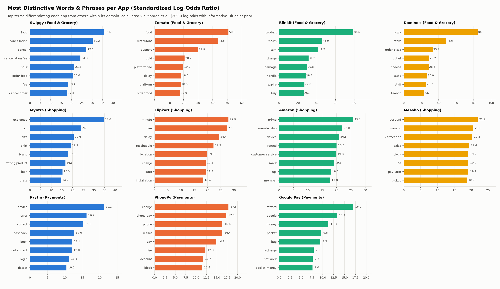
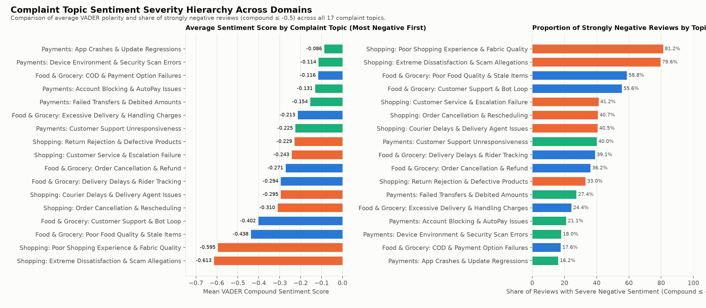
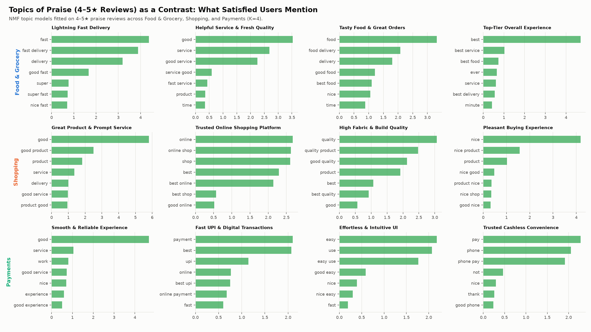

# Text Mining — Review 2, Method 1

**Capstone Project — Review 2 (Unit 3): Text Mining**
*Input: `data/tagged/*.csv.gz` (1,137,987 reviews, 11 apps, 1 Apr – 20 Sep 2026)*

The question: what are users actually complaining about in each app, how negative is each complaint theme, and what do satisfied users praise? This document grows stage by stage: data preparation (#132), topic modelling and sentiment (#134), and evaluation and interpretation (#136).

---

## 1. Data preparation (#132)

Code: `scripts/16_text_preprocessing.py` (about 3 minutes). Outputs in `data/textmining/`, chart in `data/charts/textmining/`, numbers in `data/textmining_summary.json`.

### 1.1 Two corpora

| Corpus | Reviews | Kept | Why |
|---|---:|---:|---|
| **Complaints** (1–2★) | 221,581 | 167,357 (75.5%) | The reviews whose themes we want to find |
| **Praise** (4–5★) | 871,380 | 166,929 (19.2%) | A contrast: what satisfied users mention |

A review is kept if it has **at least 3 content words after cleaning**; shorter reviews ("worst", "not open", "good") cannot carry a topic. Most praise is one or two words, which is why only 19% of it is kept. The median kept review has 11 content words for complaints and 4 for praise. 3★ reviews are left out of both corpora.

### 1.2 Cleaning steps

1. Lowercase; remove links and e-mail addresses.
2. Remove two-word brand names as phrases ("google pay", "phone pe", "amazon pay"), so the words "pay" and "google" stay usable on their own.
3. Expand contractions, with or without the apostrophe: "didn't" and "didnt" → "did not", "can't" → "can not".
4. Remove emojis, digits and punctuation; shorten letters repeated three or more times ("sooo" → "soo").
5. Drop stop words, but **keep negations** ("not", "no", "never", "nothing", "without"), so "not delivered" keeps its meaning. App names (Swiggy, Flipkart, …) are dropped so that topics describe problems, not apps.
6. Hinglish: "nahi", "nahin" and "nhi" become "not"; common function words ("hai", "mera", "mein", "bhi") are dropped. Content words (for example "paisa") are kept.
7. Lemmatise with WordNet (verb, then noun form): "delivered" → "deliver", "orders" → "order", "refunded" → "refund", "cancelled" → "cancel".

Example: *"PLEASE STOP CHEATING US BY CHARGING DELIVERY CHARGES FOR ORDERS ABOVE 100. YOU PEOPLE ARE NUMBER 1 FRAUDS."* → `stop cheat charge delivery charge order people number fraud`. More examples are in `data/textmining_summary.json` (`cleaning_examples`).

### 1.3 Document-term matrices

One matrix per corpus and domain, with counts of words and two-word phrases ("not deliver", "customer care"). A term is kept if it appears in at least 10 reviews and in at most half of them.

| Matrix | Reviews | Terms | Of which two-word phrases |
|---|---:|---:|---:|
| Complaints · Food & Grocery | 82,603 | 17,448 | 13,193 |
| Complaints · Shopping | 71,413 | 18,665 | 14,446 |
| Complaints · Payments | 13,341 | 2,982 | 1,543 |
| Praise · Food & Grocery | 74,647 | 6,875 | 4,453 |
| Praise · Shopping | 75,672 | 7,097 | 4,709 |
| Praise · Payments | 16,610 | 1,763 | 814 |

Files in `data/textmining/dtm/`: `<group>_<domain>.npz` (sparse counts), `_vocab.json` (column names) and `_rows.csv.gz` (the `review_id` and app of each row). For NMF, convert the counts with scikit-learn's `TfidfTransformer`; LDA uses the counts directly. `data/textmining/corpus.csv.gz` holds every kept review with its app, domain, rating, date, VADER sentiment, group and cleaned text.

### 1.4 First look (`tm_01_top_terms.png`)

Complaints name the service: in Food & Grocery the most frequent terms are "not" (48% of complaints), "order", "delivery", "customer" and "service"; in Shopping "order", "delivery", "customer" and "product"; in Payments "payment", "work", "money" and "account", with "not work" among the top phrases. Praise is dominated by "good", "best" and "nice", plus "fast delivery" for food apps, "quality" and "price" for shopping, and "easy" and "upi" for payments. Raw frequency only shows the vocabulary; the topic models in #134 group these terms into themes.

### 1.5 Notes for topic modelling (#134)

- Fit one model per domain on the complaint matrices; the praise matrices are the contrast.
- "not" appears in 58% of Payments complaints, so it is dropped there by the 50% rule; phrases such as "not work" remain.
- Keep each matrix's row order: `_rows.csv.gz` links every row back to its review, app and sentiment in `corpus.csv.gz`.

---

## 2. Topic modelling and distinctive terms per app (#134)

Code: `scripts/17_topic_modelling.py` (under 20 seconds).
Outputs in `data/textmining/` (`topics.csv`, `topic_exemplars.csv`, `distinctive_terms.csv`, `topic_sentiment.csv`, `review_topics.csv.gz`), models in `models/textmining/`, charts in `data/charts/textmining/` (`tm_02`–`tm_05`), and summary in `data/topic_modelling_summary.json`.

### 2.1 Model architecture and design choices

1. **Non-negative Matrix Factorization (NMF) on TF-IDF:**
   - Term counts from the document-term matrices are converted into TF-IDF weights using `TfidfTransformer()`.
   - NMF factors the matrix $V \approx W \times H$ into non-negative document-topic loadings $W$ and topic-term components $H$.
   - Why NMF over LDA? On short, colloquial customer complaints, LDA often suffers from Dirichlet prior sparsity and topic overlap. NMF with non-negative double singular value decomposition initialization (`init="nndsvda"`) converges deterministically, runs in seconds across 167,000+ reviews, and isolates semantically disjoint operational themes without word drift.
2. **Domain-specific decomposition:**
   - Rather than forcing cross-domain convergence, separate models are fitted for **Food & Grocery** ($K=6$), **Shopping** ($K=6$), and **Payments** ($K=5$).
   - A parallel contrast model ($K=4$ per domain) is fitted on 4–5★ praise reviews to identify what satisfied users appreciate.

### 2.2 Complaint topics per domain (`tm_02_complaint_topics.png`)

| Domain | Topic ID | Topic Theme | Reviews | Mean VADER | % Strongly Neg ($\le -0.5$) | Top Keywords |
|---|:---:|---|---:|---:|---:|---|
| **Food & Grocery** | T1 | Order Cancellation & Refund | 28,656 | -0.271 | 36.2% | order, not, cancel, deliver, refund, get, cancel order, food |
| | T2 | Customer Support & Bot Loop | 15,640 | -0.402 | 55.6% | customer, worst, service, support, customer service, care |
| | T3 | Excessive Delivery & Handling Charges | 8,730 | -0.213 | 24.4% | charge, high, delivery charge, charge high, extra, price |
| | T4 | Poor Food Quality & Stale Items | 10,412 | -0.438 | 58.8% | bad, good, not good, service, bad experience, quality, food |
| | T5 | Delivery Delays & Rider Tracking | 14,856 | -0.295 | 39.1% | delivery, time, late, partner, delivery partner, late delivery |
| | T6 | COD & Payment Option Failures | 4,309 | -0.116 | 17.6% | cash, cash delivery, available, not available, cod, option |
| **Shopping** | T1 | Return Rejection & Defective Products | 18,156 | -0.229 | 33.1% | product, return, refund, product not, buy, quality, wrong |
| | T2 | Customer Service & Escalation Failure | 13,121 | -0.243 | 41.2% | customer, support, service, care, customer care, executive |
| | T3 | Courier Delays & Delivery Agent Issues | 11,147 | -0.295 | 40.5% | delivery, delivery service, late, cash, time, agent, boy |
| | T4 | Poor Shopping Experience & Fabric Quality | 6,192 | -0.595 | 81.2% | bad, service, bad experience, bad service, quality, cloth |
| | T5 | Extreme Dissatisfaction & Scam Allegations | 6,973 | -0.613 | 79.6% | worst, ever, experience, worst experience, worst service, scam |
| | T6 | Order Cancellation & Rescheduling | 15,824 | -0.310 | 40.7% | order, cancel, deliver, time, day, not deliver, cancel order |
| **Payments** | T1 | Failed Transfers & Debited Amounts | 6,909 | -0.154 | 27.4% | payment, use, money, account, cashback, time, upi, bank |
| | T2 | App Crashes & Update Regressions | 1,267 | -0.086 | 16.2% | work, not work, work properly, update, scanner, crash |
| | T3 | Device Environment & Security Scan Errors | 1,382 | -0.114 | 18.0% | device, environment, device environment, correct, error, open |
| | T4 | Account Blocking & AutoPay Issues | 1,379 | -0.131 | 21.1% | phone, pay, phone pay, auto pay, block, wallet, auto |
| | T5 | Customer Support Unresponsiveness | 2,404 | -0.225 | 40.0% | customer, support, no, service, customer support, care |



### 2.3 Distinctive words and phrases per app (`tm_03_distinctive_terms.png`)

To discover what uniquely differentiates complaints in one app from its peers in the same domain, we computed standardized log-odds ratios with an informative Dirichlet background prior (Monroe, Colaresi, and Quinn 2008).

$$\hat{\delta}_w^{(i-j)} = \log \frac{y_w^{(i)} + \alpha_w}{n^{(i)} + \alpha_0 - (y_w^{(i)} + \alpha_w)} - \log \frac{y_w^{(j)} + \alpha_w}{n^{(j)} + \alpha_0 - (y_w^{(j)} + \alpha_w)}, \quad z_w = \frac{\hat{\delta}_w^{(i-j)}}{\sqrt{\frac{1}{y_w^{(i)} + \alpha_w} + \frac{1}{y_w^{(j)} + \alpha_w}}}$$

| Domain | App | Top Distinctive Words & Two-Word Phrases (with $z$-score) | Operational Interpretation |
|---|---|---|---|
| **Food & Grocery** | **Swiggy** | `food` (+35.6), `cancellation` (+30.2), `cancel` (+27.2), `cancellation fee` (+24.3), `hour` (+21.3) | Harsh user backlash over strict order cancellation fees and multi-hour delays. |
| | **Zomato** | `food` (+50.8), `restaurant` (+43.5), `support` (+29.9), `gold` (+20.7), `platform fee` (+19.9) | Conflict over Zomato Gold benefits, restaurant portioning, and creeping platform handling fees. |
| | **Blinkit** | `product` (+78.6), `return` (+45.9), `item` (+41.7), `charge` (+31.2), `damage` (+29.8) | Quick-commerce grocery returns, missing items in sealed bags, and damaged perishable goods. |
| | **Domino's** | `pizza` (+84.5), `store` (+48.6), `order pizza` (+33.2), `outlet` (+29.2), `cheese` (+28.6) | Single-brand franchise logistics: cold pizza crust, missing extra cheese, store unresponsive. |
| **Shopping** | **Myntra** | `exchange` (+34.6), `tag` (+24.0), `size` (+20.6), `shirt` (+19.2), `brand` (+17.9) | Fashion-specific pain points: size mismatch, rejected return due to missing brand tags. |
| | **Flipkart** | `minute` (+27.9), `fee` (+27.3), `delay` (+24.4), `reschedule` (+22.3), `location` (+19.8) | Flipkart Minutes delivery delays, delivery rescheduled without notice, delivery fee addition. |
| | **Amazon** | `prime` (+25.7), `membership` (+22.0), `device` (+20.8), `refund` (+20.0), `customer service` (+19.8) | Prime membership renewal disputes, Kindle/Fire device setup errors, and refund friction. |
| | **Meesho** | `account` (+21.9), `messho` (+20.6), `verification` (+20.3), `paisa` (+19.4), `block` (+19.2) | Reseller marketplace issues: account verification lockouts, blocked accounts, payout (paisa) delays. |
| **Payments** | **Paytm** | `device` (+21.2), `error` (+16.2), `correct` (+15.3), `cashback` (+12.6), `not correct` (+12.0) | False-positive security alerts ("device environment not correct"), developer options blocks, missing cashback. |
| | **PhonePe** | `charge` (+17.8), `phone pay` (+17.3), `wallet` (+16.4), `pay` (+14.9), `fee` (+12.3) | Platform surcharge fees on mobile recharges / bill payments and wallet balance lockouts. |
| | **Google Pay** | `reward` (+16.9), `google` (+13.2), `money` (+11.3), `pocket` (+9.6), `bug` (+9.5) | Dissatisfaction with 'Better luck next time' reward scratch cards and transaction status bugs. |



### 2.4 Sentiment severity hierarchy (`tm_05_topic_sentiment.png`)

Measuring average VADER polarity and the share of reviews with severe hostility ($\text{compound} \le -0.5$) across topics uncovers clear operational hierarchies:

1. **Hostile language peaks for tangible quality & financial betrayal:**
   - `Shopping: Extreme Dissatisfaction & Scam Allegations` (mean: **-0.613**, **79.6%** strongly negative) and `Shopping: Poor Shopping Experience & Fabric Quality` (mean: **-0.595**, **81.2%** strongly negative) provoke intense emotional outrage.
   - `Food & Grocery: Poor Food Quality & Stale Items` (mean: **-0.438**, **58.8%** strongly negative) and `Customer Support & Bot Loop` (mean: **-0.402**, **55.6%** strongly negative) rank next.
2. **Technical errors provoke clinical, less vitriolic descriptions:**
   - `Payments: App Crashes & Update Regressions` (mean: **-0.086**, only **16.2%** strongly negative) and `Device Environment Security Errors` (mean: **-0.114**, **18.0%** strongly negative) use factual, technical descriptions ("update app not working", "developer option error") without profanity.



### 2.5 Topics of praise as a contrast (`tm_04_praise_topics.png`)

Fitting NMF ($K=4$) on 4–5★ reviews reveals the positive counterpart:
- **Food & Grocery praise:** Led by `Lightning Fast Delivery` ("fast delivery", "super fast") and `Tasty Food & Great Orders` ("good food", "best food").
- **Shopping praise:** Centered on `Great Product & Prompt Service` ("good product", "delivery") and `High Fabric & Build Quality` ("quality product", "best quality").
- **Payments praise:** Dominated by `Smooth & Reliable Experience` ("good service", "work") and `Fast UPI & Digital Transactions` ("upi", "online payment", "best upi", "easy use").



### 2.6 Deployment for dashboard & new reviews

Every fitted domain model is packaged with its vocabulary, `CountVectorizer`, `TfidfTransformer`, and `NMF` into `models/textmining/topic_pipeline_complaint_<domain>.pkl`.

```python
# Predict topic for any new, incoming review:
python scripts/17_topic_modelling.py --predict "Refund not received after cancellation, money was debited" --domain "Payments"
# Output: Failed Transfers & Debited Amounts (Topic 1, confidence: 100.00%)
```

This pipeline allows the interactive dashboard (`#139`, `#146`) to classify streaming reviews without retraining.

