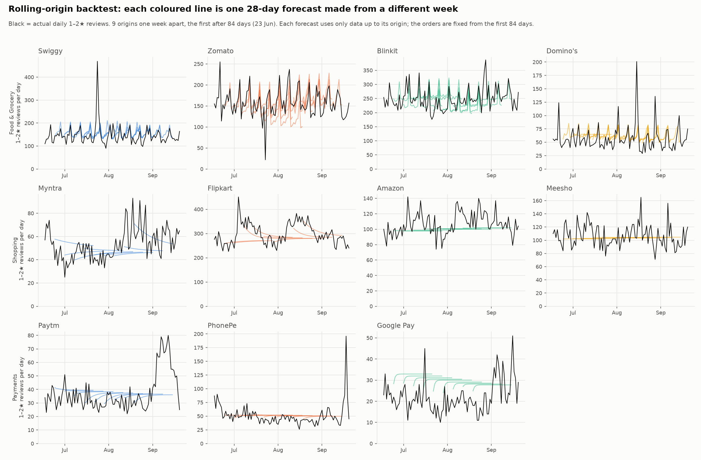
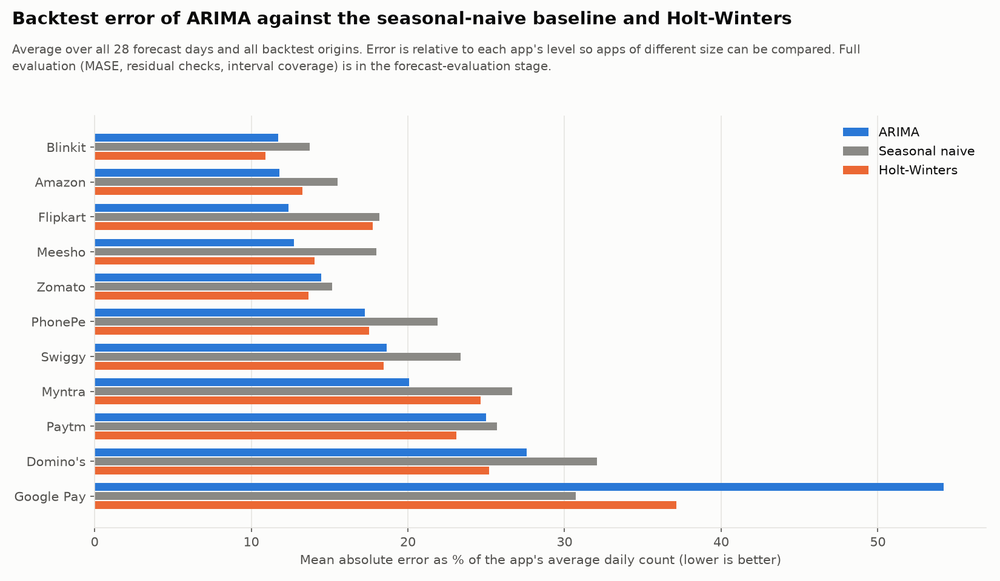
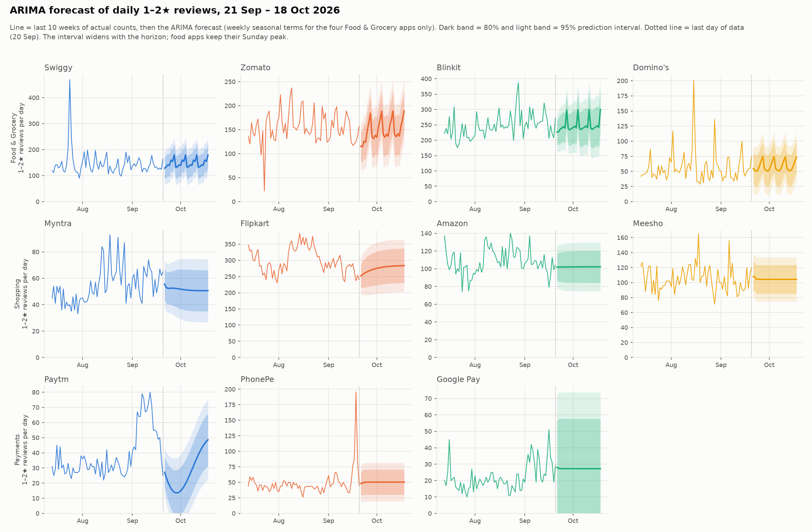

# Time-Series Analysis — Review 2, Method 2

**Capstone Project — Review 2 (Unit 3): Time-Series Analysis**
*Input: `data/tagged/*.csv.gz` (1,137,987 reviews, 11 apps, 1 Apr – 20 Sep 2026)*

The question: how many 1–2★ reviews will each app get in the coming weeks, and did a new app version make things worse? This document grows stage by stage: data preparation (#131), ARIMA forecasting (#135), forecast evaluation (#137) and update impact (#138).

---

## 1. Data preparation (#131)

Code: `scripts/15_time_series_data.py` (about 10 seconds). Tables in `data/timeseries/`, charts in `data/charts/timeseries/`, numbers in `data/timeseries_summary.json`.

### 1.1 The series

The modelled series is the **daily count of 1–2★ reviews per app** (173 days, 1 Apr – 20 Sep 2026). Counts are used instead of the share of 1–2★ reviews, because the late-April feed gap removes mostly positive reviews, which distorts shares far more than counts.

| File | Contents |
|---|---|
| `daily_app.csv` | One row per app per day: reviews, 1–2★ and 4–5★ counts, mean rating, mean sentiment, share of 1–2★, the 9 issue counts, weekday, and the quality flags below |
| `daily_domain.csv` | The same, summed per domain |
| `weekly_app.csv`, `weekly_domain.csv` | Monday–Sunday weeks; `complete_week` marks weeks fully inside the window (24 of 25) |
| `release_events.csv` | One row per app version: first day seen, reviews, rating, share of 1–2★, and whether it counts as a new release |
| `stl_components.csv` | STL trend, weekly seasonal and remainder components per app |
| `patterns_by_app.csv` | Trend and seasonal strength, weekday effect, trend change, suggested differencing |
| `stationarity.csv` | ADF tests on the level, the first difference, the weekly difference and both |
| `acf_pacf.csv` | ACF and PACF for lags 0–28, for the level and the weekly difference |

### 1.2 Data-quality flags

| Flag | Meaning | How to use it |
|---|---|---|
| `feed_gap` | 21 Apr – 5 May for Swiggy, Blinkit, Domino's, Flipkart and Amazon (75 app-days). Positive reviews are mostly missing from the Play Store feed; 1–2★ counts fall far less | Pass it to ARIMA as an extra input (SARIMAX) so the model does not read the dip as a real change |
| `source_gap`, `source_coverage` | Zomato has no reviews from 23 Jul 22:00 to 25 Jul 12:30. Coverage is 0.92, 0 and 0.48 for those three days | 24 Jul is filled in `neg_reviews_filled` with the mean of the same weekday one and two weeks either side (165.5). 23 and 25 Jul keep their real counts, because reviews arrive in a burst after the outage |
| `neg_reviews_filled` | `neg_reviews` with only the fully missing Zomato day filled | Use this column for models; `neg_reviews` stays raw |

### 1.3 Release events

`app_version` is the version on the reviewer's phone, so the first day a version appears marks its rollout. 2,507 versions appear in the reviews; 558 have at least 30 reviews. A version counts as a **new release** (`use_for_update_impact`) only if it:

1. has at least 30 reviews;
2. first appears after 1 Apr (a version already present on 1 Apr was released earlier); and
3. is numbered higher than every version seen before it. This removes old builds that some users still run, which otherwise appear as "new" late in the window (for example Amazon 12.0 in September).

That leaves **224 release events**, from 12 (PhonePe) to 38 (Zomato) per app. `first_seen_10th_review` gives a date that ignores a few early-access reviews. Chart: `ts_04_release_events.png`.

### 1.4 Time-based patterns

**Levels and trend** (`ts_01_daily_negative_reviews.png`, `ts_02_stl_trend.png`). Flipkart (282 a day) and Blinkit (251) get the most 1–2★ reviews; Google Pay the fewest (27). Comparing the first and last four weeks (gap days excluded), Paytm rises most (+60%, a September jump) and Myntra (+22%), Amazon (+14%) and Blinkit (+13%) also rise, while Google Pay (−20%), Domino's (−18%), Swiggy (−16%) and Zomato (−11%) fall. The STL trend is strongest for Flipkart (strength 0.81), Paytm (0.67) and Myntra (0.60). The series also show short spikes, such as Swiggy in late July and Google Pay in mid-May, which a forecast should flag rather than predict.

**Weekly pattern** (`ts_03_weekday_effect.png`). Food apps get clearly more complaints on **Sundays**: Domino's +38%, Swiggy +28%, Zomato +28% and Blinkit +22% against their weekly mean, and fewer early in the week. Shopping apps have no real weekday pattern (within ±6%). Payment apps vary a little more: Google Pay +11% on Mondays and Thursdays and −11% on Saturdays, PhonePe −9% on Sundays. Seasonal strength from STL is 0.41–0.56 for Zomato and Blinkit and below 0.27 elsewhere.

**Stationarity** (`stationarity.csv`). The ADF test (lag length chosen by AIC) rejects a unit root at 5% for the level of 9 of 11 apps. Zomato (p = 0.066) and Blinkit (p = 0.094) are not stationary in level; after a first or weekly difference every app is stationary (p < 0.03).

**Autocorrelation** (`acf_pacf/<app>.png`, `acf_pacf.csv`). Lag-1 autocorrelation is 0.14 (Meesho) to 0.82 (Flipkart). Zomato and Blinkit have clear weekly spikes (ACF at lag 7: 0.43 and 0.50; at lag 14: 0.33 and 0.29); Flipkart, Myntra and Paytm show slow decay, which matches their stronger trend. The 95% limits are ±0.149.

### 1.5 Starting points for the ARIMA models (#135)

| | Suggestion | Why |
|---|---|---|
| Series | `neg_reviews_filled` per app | Raw counts with only the missing Zomato day filled |
| d (non-seasonal differencing) | 1 for Zomato and Blinkit, 0 for the rest (`suggested_d`) | ADF on the level |
| D (seasonal differencing) | 0 for every app (`suggested_D`) | STL seasonal strength is below 0.64 everywhere |
| Seasonal terms | Try a seasonal AR or MA term at lag 7 for Zomato, Blinkit and the other food apps | Weekly ACF spikes and the Sunday effect |
| Extra input | `feed_gap` as an exogenous dummy | The late-April dip for five apps |

These are starting points; the orders are chosen in #135 from the ACF/PACF charts and AIC.

---

## 2. ARIMA forecasting with a rolling backtest (#135)

Code: `scripts/19_forecasting.py` (about 1 minute). Tables in `data/timeseries/`, charts `ts_05`–`ts_07` in `data/charts/timeseries/`, numbers in `data/forecasting_summary.json`.

### 2.1 Models

The forecast target is the daily count of 1–2★ reviews per app (`neg_reviews_filled`, 173 days). Three models are fitted at every step so the main model has something to beat:

| Model | What it does | Intervals |
|---|---|---|
| **ARIMA / SARIMA** (main) | ARIMA, with seasonal terms at lag 7 (a weekly cycle, i.e. SARIMA) only for the four Food & Grocery apps (Swiggy, Zomato, Blinkit, Domino's), which have a strong weekday pattern; the other seven apps get a plain ARIMA. For Swiggy, Blinkit, Domino's, Flipkart and Amazon the 0/1 `feed_gap` dummy is an extra input (SARIMAX); it is 0 for every forecast day because the gap is in the past | 80% and 95% |
| **Seasonal naive** (baseline) | Forecast = the count of the same weekday last week | none |
| **Holt-Winters** (optional comparison) | Exponential smoothing with a damped additive trend and an additive weekly season | none |

Forecasts and interval limits below zero are set to 0, because counts cannot be negative.

### 2.2 How the orders were chosen (`arima_orders.csv`, `arima_candidates.csv`)

1. **d** is fixed from the ADF test of Stage 1: 1 for Zomato and Blinkit, 0 for the rest; **D = 0** everywhere (seasonal strength is below 0.64). A constant is included only when d = 0.
2. **ACF/PACF propose.** On the (differenced) training series, p goes up to the last PACF lag outside ±1.96/√n among lags 1–3, q up to the last significant ACF lag among 1–3, and a seasonal AR (or MA) term at lag 7 is tried if the PACF (or ACF) is significant at lag 7 **or** the app has a strong weekday effect in Stage 1 (a weekday 15% or more away from the weekly mean: the four food apps, +22% to +38% on Sundays; every other app is below 15%). This gives 6 to 36 candidate orders per app.
3. **AICc chooses.** Every candidate is fitted and the lowest corrected AIC wins; any order within 2 AICc points of the minimum counts as equally good and the one with the fewest terms is taken. All 378 candidate fits converged, and every candidate with its AICc is in `arima_candidates.csv`.
4. **No look-ahead.** For the backtest the orders are chosen on the **first 84 days only**; for the final forecast they are chosen again on all 173 days. Both choices are in `arima_orders.csv` (`stage` = `backtest` or `final`).

Final orders (p, d, q)(P, 0, Q)₇:

| Domain | App | Order | Notes |
|---|---|---|---|
| Food & Grocery | Swiggy | (0,0,1)(1,0,1) | seasonal AR and MA at lag 7; feed-gap input |
| | Zomato | (2,1,1)(1,0,1) | differenced once |
| | Blinkit | (1,1,1)(1,0,1) | differenced once; feed-gap input |
| | Domino's | (0,0,1)(1,0,1) | seasonal terms because of its +38% Sunday effect; feed-gap input |
| Shopping | Myntra | (3,0,2) | |
| | Flipkart | (1,0,1) | strong trend, handled by the AR term; feed-gap input |
| | Amazon | (1,0,1) | feed-gap input |
| | Meesho | (0,0,2) | |
| Payments | Paytm | (2,0,2) | |
| | PhonePe | (1,0,0) | |
| | Google Pay | (1,0,0) | |

The four food apps are the only ones with seasonal terms, which matches the Sunday peak found in Stage 1. Shopping and payment apps need only short-memory terms. As a check, forcing seasonal terms onto those seven apps changed their backtest error by less than 1.5 reviews a day (Paytm, PhonePe and Google Pay: no change; Myntra and Meesho slightly worse), so plain ARIMA is enough for them.

### 2.3 Rolling-origin backtest (`backtest_forecasts.csv`, `backtest_summary.csv`, `ts_06_rolling_backtest.png`)

The models are fitted on the first 84 days (12 weeks), forecast the next 28 days, then the origin moves one week forward and every model is refitted: **9 origins** (23 Jun to 18 Aug), each with a 28-day forecast, so 252 forecast days per app and model. Every row of `backtest_forecasts.csv` has the origin, the horizon (1–28 days), the actual count, the forecast and, for ARIMA, the 80% and 95% limits. Stage 4 (#137) uses this table for MASE, residual checks, interval coverage and unusual-day alerts.

### 2.4 Comparison with the baseline (`ts_07_backtest_mae_vs_baseline.png`)

Mean absolute error over all 28 forecast days, in reviews per day (lower is better; best per app in bold):

| App | ARIMA | Seasonal naive | Holt-Winters |
|---|---:|---:|---:|
| Swiggy | 27.6 | 34.6 | **27.4** |
| Zomato | 22.8 | 23.9 | **21.5** |
| Blinkit | 28.8 | 33.8 | **26.8** |
| Domino's | 15.8 | 18.3 | **14.4** |
| Myntra | **10.5** | 13.9 | 12.8 |
| Flipkart | **38.1** | 56.0 | 54.7 |
| Amazon | **12.9** | 16.9 | 14.5 |
| Meesho | **13.6** | 19.3 | 15.1 |
| Paytm | 8.6 | 8.8 | **7.9** |
| PhonePe | **7.9** | 10.0 | 8.0 |
| Google Pay | 10.9 | **6.2** | 7.5 |

- **ARIMA beats the seasonal-naive baseline for 10 of 11 apps.** The largest gains are for Flipkart (−32%), Meesho (−30%), Myntra (−24%), Amazon (−24%) and PhonePe (−21%), the apps with a trend or slow-moving level that "same day last week" misses.
- **It does not beat the baseline for Google Pay.** Google Pay has a low, noisy level with short spikes (mid-May and September) and its level shifts, so a model that returns to the training mean is a poor guide, while last week's value adapts faster. For Google Pay ARIMA forecasts about 28 a day while the actual level over the backtest was about 20.
- **Holt-Winters is as good as or better than ARIMA for the four Food & Grocery apps and for Paytm** (Domino's: 14.4 against 15.8), and clearly worse for Flipkart and Myntra. ARIMA stays the main model because it is the only one with prediction intervals and because it takes the feed gap as an input.
- Error grows with the horizon for the trending apps (Flipkart ARIMA 31.8 in days 1–7, 37.1 in days 15–28), but not for apps that are already close to their mean.

The 80% and 95% intervals contained 81% and 93% of the backtest days, close to their nominal levels (a first check only; the formal coverage test is #137).

### 2.5 Forecast for 21 Sep – 18 Oct 2026 (`forecast_daily.csv`, `forecast_weekly.csv`, `ts_05_forecast_next_4_weeks.png`)

The final models are fitted on all 173 days and forecast four Monday–Sunday weeks. `forecast_daily.csv` has the daily forecast of all three models (ARIMA with 80% and 95% limits); `forecast_weekly.csv` has the weekly totals, whose intervals come from 2,000 simulated future paths of the ARIMA model.

Expected number of 1–2★ reviews in the first forecast week (21–27 Sep), with the 80% interval and the average of the last four weeks of data:

| App | Week 1 forecast | 80% interval | Last 4 weeks (weekly average) |
|---|---:|---|---:|
| Flipkart | 1,830 | 1,596 – 2,056 | 1,973 |
| Blinkit | 1,711 | 1,488 – 1,929 | 1,849 |
| Swiggy | 1,037 | 889 – 1,180 | 973 |
| Zomato | 977 | 811 – 1,151 | 1,054 |
| Meesho | 737 | 676 – 801 | 712 |
| Amazon | 714 | 642 – 786 | 758 |
| Domino's | 413 | 327 – 495 | 386 |
| Myntra | 371 | 318 – 424 | 414 |
| PhonePe | 348 | 270 – 431 | 385 |
| Google Pay | 192 | 105 – 310 | 187 |
| Paytm | 136 | 75 – 205 | 348 |

How to read it:

- **Food apps keep their weekly shape**: Zomato, Blinkit, Swiggy and Domino's forecasts peak on Sundays, as the seasonal terms learned (Domino's: about 75 on Sundays against about 50–52 on Tuesdays and Wednesdays).
- **Shopping and payment apps are nearly flat**: with no seasonality the forecast returns to a level within days, and the interval carries the uncertainty. Flipkart's forecast rises slowly from 252 to 284 a day.
- **Intervals are wide for noisy apps.** Google Pay's 95% daily interval is about 0–74 for a forecast of 27, and Swiggy's reaches about 250 against a forecast of 130–180, because of the short spikes in the training data. The intervals are an honest statement that single days cannot be predicted well; weekly totals are much better determined.
- **Paytm is the one forecast to treat with care.** Paytm jumped from about 30 to 80 a day in September and fell back to 25 on 20 Sep. The (2,0,2) model fitted on that shape swings below the long-run mean first (forecast 136 in week 1, −61% against the last four weeks) and then back up. `forecast_weekly.csv` carries `change_vs_last_4_weeks_pct`, and `forecasting_summary.json` lists Paytm under `large_week1_changes`. Treat this app's forecast as unreliable until the September level shift is explained; the forecast-evaluation stage should flag it.

### 2.6 Outputs for the next stages

| Used by | Files |
|---|---|
| Forecast evaluation and write-up (#137, #142) | `backtest_forecasts.csv`, `backtest_summary.csv`, `arima_orders.csv`, `arima_candidates.csv` |
| Dashboard forecasting page and recommendations (#140, #141) | `forecast_daily.csv`, `forecast_weekly.csv`, `forecasting_summary.json` |

### 2.7 Limits

- Only 173 days are available, so there is no yearly pattern and the backtest has just 9 origins; the first origin already needs 84 days.
- The series are counts of reviews, which depend on app traffic and campaigns that the model does not see. The forecast answers "what if the next weeks look like the recent past", not "what will a campaign do".
- Level shifts and spikes (Paytm in September, Swiggy in late July) are not predictable by ARIMA; they widen the intervals instead.
- The forecast does not include release dates. Whether a new version raises the count is the question of the update-impact stage (#138).
