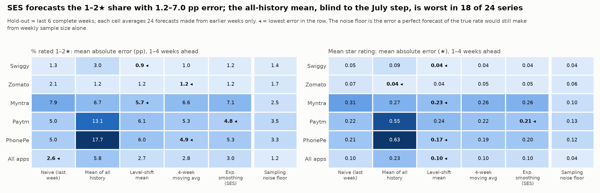

# Review 2 Sections (moved out of REPORT.md)

These sections were written for Review 2 on our **first dataset** (15,000 `MOST_RELEVANT` reviews of 5 apps, now in `review_2_prep/data/v1_most_relevant/`). They are kept here as the starting point for Review 2 and must be redone on the current Review 1 dataset (1,218,358 reviews of 11 apps) before they are used. Section numbers are the original ones from REPORT.md; paths inside them are relative to the repository root as it was then (the time-series files are now under `review_2_prep/`).

---

## 8. Method 1: Text Mining

> **Original note on data version.** Sections 8 to 11 (Review 2) were produced on our first dataset: 15,000 `MOST_RELEVANT` reviews of 5 apps, kept in `data/v1_most_relevant/`. Sections 2 to 7 (Review 1) use the new collection of 1,218,358 reviews of 11 apps. The tagging and sentiment scripts have already been re-run on the new data (their outputs feed Sections 4 to 7), but the numbers quoted in Sections 8 to 11 have not been updated yet.

Scripts: `scripts/03_tag_issues.py` and `scripts/04_sentiment_analysis.py`. Full details are in `TEXT_MINING.md`.

### 8.1 Data preparation and implementation

Issue tagging:

- We defined 9 issue categories that fit food delivery, shopping and payment apps.
- Each category has a list of keyword patterns. If a review matches a pattern, the category is marked 1.
- A review can have more than one category. For example, a crash can lead to a double payment and then a support complaint.
- The category with the most matches becomes the `primary_issue`.

| Category | Examples of what it covers |
|---|---|
| Crash and Stability | App crashes, freezing, loading errors |
| Payment and Refund | Failed payment, money deducted, refund delay |
| Delivery Delay | Late delivery, rider delay, wrong tracking |
| Order Quality | Wrong or missing item, damaged or stale product |
| Cancellation and Return | Cannot cancel, return rejected, pickup delay |
| Customer Support | No reply, chatbot loop, ticket closed without a fix |
| Account, Login and OTP | OTP not received, login failure, blocked account |
| Pricing and Fraud | Hidden fees, overcharging, coupon not applied |
| UI/UX and Update | Bad update, confusing screen, too many ads |

Sentiment scoring:

- We used VADER from the NLTK library. It is rule-based and made for short informal text. It handles capital letters, exclamation marks and words like "very".
- It needs no training, so it cannot leak information into the classifier.
- Each review gets a compound score from -1 to +1. The label is Negative if the score is -0.05 or below, Positive if it is +0.05 or above, and Neutral in between.

### 8.2 Evaluation and interpretation

Issue tagging results:

- 9,801 of 14,988 reviews (65.4%) have at least one issue tag. On average a review has 1.12 tags.

| Issue | Reviews | % of all reviews | Mean sentiment | Average rating |
|---|---:|---:|---:|---:|
| Customer Support | 5,150 | 34.4 | -0.331 | 1.19 |
| Cancellation and Return | 2,923 | 19.5 | -0.348 | 1.56 |
| Delivery Delay | 2,301 | 15.4 | -0.437 | 1.23 |
| Payment and Refund | 2,278 | 15.2 | -0.379 | 1.27 |
| Pricing and Fraud | 1,414 | 9.4 | -0.445 | 1.30 |
| Order Quality | 996 | 6.6 | -0.504 | 1.13 |
| Crash and Stability | 938 | 6.3 | -0.102 | 1.71 |
| UI/UX and Update | 364 | 2.4 | +0.139 | 2.71 |
| Account, Login and OTP | 356 | 2.4 | -0.170 | 1.49 |


Sentiment validation against star ratings:

- Pearson correlation between the sentiment score and the rating: 0.60.
- Spearman correlation: 0.56.
- The sentiment label matches the rating class (1-2 stars negative, 3 stars neutral, 4-5 stars positive) for 72.0% of reviews.

| Rating | Reviews | Mean sentiment | % Negative | % Positive |
|---|---:|---:|---:|---:|
| 1 star | 10,366 | -0.355 | 71.9 | 24.1 |
| 2 stars | 742 | -0.136 | 54.7 | 35.3 |
| 3 stars | 579 | +0.069 | 41.3 | 49.7 |
| 4 stars | 673 | +0.399 | 19.0 | 74.4 |
| 5 stars | 2,628 | +0.673 | 6.7 | 90.4 |


Sentiment by app:

| App | Average rating | % Negative | % Positive | Top issue |
|---|---:|---:|---:|---|
| Swiggy | 1.21 | 73.8 | 22.8 | Customer Support |
| Zomato | 1.43 | 68.5 | 27.9 | Customer Support |
| Paytm | 2.06 | 49.7 | 43.3 | Customer Support |
| Myntra | 2.65 | 47.3 | 50.9 | Cancellation and Return |
| PhonePe | 2.46 | 40.8 | 52.8 | Customer Support |


What this tells us:

- Problems with money and physical goods make users the angriest. Order Quality has the most negative sentiment (-0.504), then Pricing and Fraud (-0.445).
- Customer Support is the most common complaint in four of the five apps.
- Crash reviews use calmer, more technical language (-0.102).

Limitations of the text mining:

- 24.1% of 1-star reviews get a positive sentiment label. These are mostly sarcastic reviews, or reviews that start politely before complaining. VADER cannot detect sarcasm.
- The tagger looks for keywords and does not know if the user is praising or complaining. 333 five-star reviews are tagged Cancellation and Return, and 92% of them are Myntra users praising easy returns.
- 22% of 1-2 star reviews get no tag. Missed topics include Paytm security-scan warnings, QR scanning, notifications and rewards.

---

## 9. Method 2: Time-Series Analysis

Script: `scripts/13_time_series_forecast.py`. Full details are in `TIME_SERIES.md`.

### 9.1 Data preparation and implementation

- Input: `data/app_reviews_tagged.csv`, using the `review_date` column.
- Reviews were grouped into Monday-to-Sunday weeks, for each app and for all apps together.
- Weekly measures: number of reviews, average rating, share of 1-2 star reviews, share of negative-sentiment reviews, share of reviews with an issue tag, and the share for each of the 9 issue categories.
- Weeks with no reviews are kept with a count of 0. We did not fill them in with estimated values.
- The last week (14 to 20 September) is not complete, so it was left out.
- Modelling window: 20 April to 13 September 2026. These are the 21 complete weeks in which every app has at least 30 reviews. They contain 12,428 reviews (82.9% of the data).
- We did not forecast review volume. Each app was scraped up to a fixed 3,000 reviews, so the weekly count shows how the feed spread those reviews over time. It does not show how many reviews users actually posted.

Forecasting models (all simple and easy to explain):

| Model | How it forecasts |
|---|---|
| Naive | Same as last week |
| Mean of all history | Average of all past weeks |
| Level-shift mean | Average of the weeks after the July 2026 change |
| 4-week moving average | Average of the last 4 weeks |
| Simple exponential smoothing (SES) | Weighted average that gives more weight to recent weeks |

Why not ARIMA or seasonal models: 21 weeks is too short. There is no full year to learn seasonality from, and there is a sudden level change in the middle of the series.

Test setup:

- The last 6 weeks (3 August to 13 September) were held out as the test period.
- Each test week was forecast 1, 2, 3 and 4 weeks ahead, using only the weeks before it.
- No test week is used in training, so there is no data leakage.
- Error measures: MAE, RMSE, bias, and skill compared with the naive forecast.
- Final forecast: SES, for the 4 weeks starting 14 September, 21 September, 28 September and 5 October 2026, with an 80% prediction interval.

### 9.2 Evaluation and interpretation

Weekly trend:


| Series | % rated 1-2 stars, before July | After July | Change |
|---|---:|---:|---:|
| Swiggy | 97.8 | 93.4 | -4.3 |
| Zomato | 88.9 | 88.5 | -0.4 |
| Myntra | 63.6 | 54.3 | -9.3 |
| Paytm | 74.5 | 60.8 | -13.8 |
| PhonePe | 65.7 | 43.5 | -22.2 |
| All apps | 77.9 | 71.1 | -6.8 |

- The weekly series shows one step down around 1 July 2026 and is then flat.
- After the step, no app shows a statistically significant trend in rating, 1-2 star share, sentiment or issue rate.
- As explained in Section 4, most of the step comes from the change in sampling.

Forecast accuracy on the 6 test weeks (MAE in percentage points for the share of 1-2 star reviews, 1 to 4 weeks ahead):

| Series | Naive | All-history mean | Level-shift mean | 4-week average | SES |
|---|---:|---:|---:|---:|---:|
| Swiggy | 1.31 | 2.98 | 0.85 | 1.03 | 1.16 |
| Zomato | 2.06 | 1.25 | 1.21 | 1.18 | 1.23 |
| Myntra | 7.94 | 6.74 | 5.73 | 6.65 | 7.06 |
| Paytm | 5.04 | 13.13 | 6.13 | 5.35 | 4.77 |
| PhonePe | 5.04 | 17.72 | 5.97 | 4.89 | 5.34 |
| All apps | 2.65 | 5.85 | 2.68 | 2.75 | 3.05 |



- SES beats the naive forecast in 19 of the 24 series we tested (6 series and 4 measures).
- The level-shift mean has the best average rank (2.04), then the 4-week average (2.29), then SES (2.67). The differences among these three are small.
- The mean of all history is the worst model in 18 of 24 series, because it ignores the July change.
- For Swiggy and Zomato the error is about 1 point. This is as low as the weekly sample size allows.
- The 80% intervals are on the safe side: 92% of the actual test values fall inside them.

Forecast for the next 4 weeks (SES):

| Series | % rated 1-2 stars | 80% interval at week 4 | Average rating |
|---|---:|---|---:|
| Swiggy | 93.2 | 89.0 to 97.4 | 1.25 |
| Zomato | 88.6 | 84.8 to 92.5 | 1.41 |
| Myntra | 58.1 | 45.3 to 70.9 | 2.74 |
| Paytm | 58.7 | 46.5 to 71.0 | 2.54 |
| PhonePe | 38.2 | 17.0 to 59.4 | 3.23 |
| All apps | 67.9 | 61.5 to 74.2 | 2.20 |


Search for sudden spikes:

- For each app, each issue and each week, we checked whether the issue rate was far above that app's normal rate.
- Only 1 of 523 cases was flagged (Swiggy, Order Quality, week of 29 June), and about 1 would be expected by chance. So no failure spike linked to a release is visible.

Limitations of the time-series analysis:

- Only 21 weeks of data, with one sudden change in the middle.
- The forecast is a flat line. It gives the expected level, not a rise or fall.
- The forecast holds only if the Play Store feed keeps behaving as it has since July.
- Weekly samples are small (38 to 312 reviews per app), so 1 to 4 points of error is unavoidable.

---

## 10. Combined Business Insights and Recommendations

### 10.1 What the methods say together

- Text Mining tells us what the problems are. Time-Series tells us when they move. The classifier finds which reviews carry a problem. EDA tells us how far the data can be trusted.
- Weekly negative sentiment moves together with the weekly share of 1-2 star reviews (correlation 0.82 for all apps). So sentiment can be used as an early signal even before ratings are averaged.
- The issue mix of each app stays the same from week to week. The problems are steady and long-running. They are not short spikes.
- The one big movement in the data (July 2026) comes from how the reviews were sampled. All four stages point to this.
- The star-rating target used by the classifier is the same quantity that the time-series tracks each week (share of 1-2 star reviews). Its level is not fixed: 77.9% before July and 71.1% after.

### 10.2 Recommendations

1. Swiggy and Zomato: fix customer support first. It appears in 48% and 45% of their reviews, with an average rating of 1.19 stars. Delivery delay (about 29%) comes next.
2. Myntra: review the cancellation and return process. It appears in 40% of reviews.
3. Paytm: look into crashes and stability. This issue is in 17% of reviews, and it is the one major issue that did not fall after July (18.9% to 20.1%).
4. Treat Order Quality complaints as high priority in all apps. They are few (6.6%) but have the worst rating (1.13 stars) and the most negative sentiment.
5. Use the classifier to sort incoming reviews. Use Random Forest when no complaint should be missed and Logistic Regression when false alarms must be low.
6. Track the weekly share of 1-2 star reviews against the forecast band. A week outside the 80% band should be checked. This works well for Swiggy and Zomato, whose bands are narrow (about 4 points on each side). The band is too wide for PhonePe (about 21 points on each side).
7. Collect reviews every week using the `NEWEST` order, not one large `MOST_RELEVANT` pull. This removes the sampling problem and makes it possible to measure the effect of each app update.
8. Improve the tagger: separate praise from complaints for returns, and add patterns for security warnings, QR scanning, notifications and rewards.

---

## 11. Interactive Dashboard

Files: `dashboard/app.py`, `dashboard/utils.py`, `dashboard/charts.py`. Built with Streamlit and Plotly.

How to run:

```bash
pip install -r dashboard/requirements.txt
streamlit run dashboard/app.py
```

The dashboard reads the files already produced by the scripts. It does not run the analysis again, so it opens quickly.

Filters in the sidebar:

- App: All apps or one of the five apps
- Period: common window, 2026 to date, full history, or a custom date range
- Metric: review volume, average rating, share of 1-2 stars, share of 4-5 stars, negative sentiment, issue-tag rate, review length
- Option to hide weeks with fewer than 30 reviews

| Tab | What it shows |
|---|---|
| Overview | 12 summary numbers, app comparison chart and table. When one app is chosen it also shows that app's profile. |
| Weekly trends | The chosen metric by week, for each app or pooled, and the weekly rating mix |
| Forecast | History, 4-week forecast and 80% band, with a choice of metric, model and horizon, and the accuracy of each model |
| Sentiment and issues | Sentiment split, rating split, issue ranking, app by issue heatmap, weekly issue trend |
| Key findings | Ten main findings, with the numbers read from the saved result files |

All charts update when a filter is changed, and hovering over a chart shows the exact value and the number of reviews behind it.


---

## Conclusion points that belong to Review 2 (first dataset)

- VADER sentiment agrees reasonably well with star ratings (correlation 0.60), and at the weekly level it moves closely with the share of low ratings.
- The weekly share of negative reviews can be forecast within about 1 to 7 percentage points using simple models. The forecast is a level, not a trend.

## Reference used by these sections

[6] R. J. Hyndman and G. Athanasopoulos, Forecasting: Principles and Practice, 3rd edition, OTexts, 2021.

---

## Review 2 items removed from the Review 1 report (REPORT.md)

4. How do complaints change from week to week, and can we forecast the next few weeks? (Review 2)

- **Update impact:** how ratings and complaints change between app versions. In Review 1 we compare each version with its app's average (Section 4, charts 12 and 13). In Review 2 we will compare ratings and complaints just before and just after each new version first appears. This is possible because the new data is a continuous daily record from 1 April 2026 for every app.

6. Build weekly series, compare ratings and complaints before and after each new app version, and forecast (Time-Series Analysis, Review 2).
7. Put everything into an interactive dashboard (Review 2).

MAE and RMSE will be used for the forecasts in Review 2.

| Time-series (Review 2) | #111 | Kanishka D | `review_2_prep/scripts/13_time_series_forecast.py`, `review_2_prep/data/timeseries/`, `review_2_prep/TIME_SERIES.md` |
| Dashboard (Review 2) | #112 | Kanishka D | `review_2_prep/dashboard/` |
| Slides, report and final documents | #113, #114 | Kanishka D | `review_2_prep/old_v1_documents/`, `REPORT.md` |

| Kanishka D | CB.SC.U4CSE23155 | Time-series, dashboard and final assembly | Built the weekly tables and the forecasting test with five models. Built the Streamlit dashboard. Prepared the first slide deck and report (on the first dataset). | `review_2_prep/scripts/13_time_series_forecast.py`, `review_2_prep/data/timeseries/`, `review_2_prep/TIME_SERIES.md`, `review_2_prep/dashboard/`, `review_2_prep/old_v1_documents/` |

Review 1 work is complete. Review 2 work (the text-mining write-up, time-series forecasting and the dashboard, redone on the current dataset) is being prepared in `review_2_prep/`.

Weekly forecasting and an interactive dashboard follow in Review 2.
